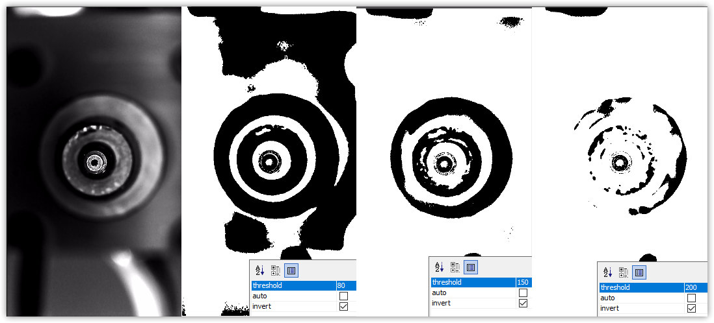
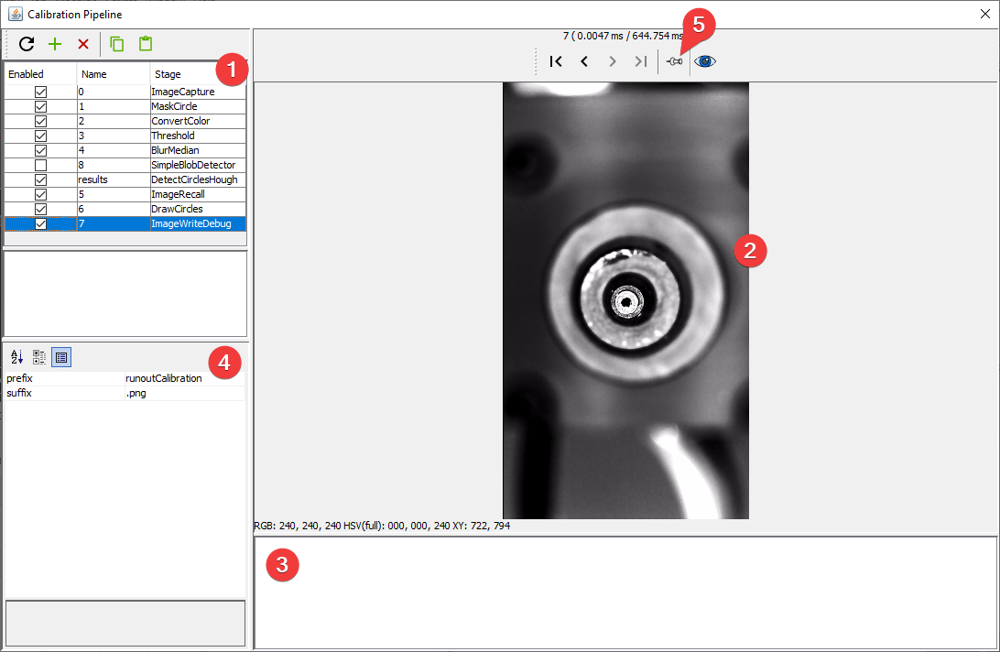

Computer vision is one of the most important and complicated elements of a pick and place machine. Vision is used in four main places:

- [Finding your homing fiducial (Top Camera)](2-homing-fiducial-pipeline.md)
- [Finding the fiducial marks on your PCBs (Top Camera)](3-pcb-fiducial-pipeline.md)
- [Finding the tips of your nozzles (Bottom Camera)](4-nozzle-calibration-pipeline.md)
- [Confirming and orienting the parts the machine has picked up. (Bottom Camera)](5-part-identification-pipeline.md)

We've included good settings in the [default machine configuration](/openpnp/calibration/1-import-config) to get you started, but you will likely need to tune the settings for your exact needs depending on the ambient light in your room, the settings you used when configuring your cameras, and the kinds of components you're placing.

## Ambient light

Because machine vision is heavily dependent on lighting, we recommend maintaining consistent lighting in the room where you're operating the LumenPnP. Changing the lighting in the room can require readjusting your vision settings. 

## Computer Vision Basics

Computer vision used in OpenPnP takes photos from your top or bottom camera and passes them through a "Pipeline" of stages to identify what is in the image. Stages fall into a few categories:

1. Manipulating the photo to make it easier for the computer to identify parts of the photo. For example: `Threshold`.
2. Identifying certain elements of the photo. For example: `DetectCirclesHough`.
3. Showing you more information on the screen so that you can build, debug, and tweak the pipeline. For example: `DrawCircles`.

You will need to fine-tune each stage to adjust how it works by changing its "parameters." For example, the `Threshold` stage takes in the photo from your camera (or the previous stage in the pipeline) and turns it into stark black and white. It uses a `threshold` parameter to pick the brightness level where the distinction is made.

For more complicated changes to your pipeline can also add and remove stages.

## Pipeline Editing View

The pipeline editing view has several sections and features:

1. The list of stages. Click on a stage to show it's results in the main view, and show its parameters in the stage settings.
2. The main view. This shows the result of the currently selected stage unless a particular stage is pinned (see #5).
3. Stage output. This shows error messages if there's a problem with your stage or pipeline.
4. Stage settings. This lets you change the settings for the selected stage.
5. Pin Image. This lets you keep the results of the currently selected stage on on main view, even if you select another stage. Use this to pin a debugging stage so that you can quickly see the results of changes to a stage you're editing.

