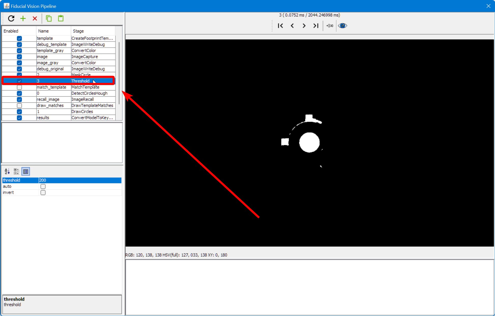
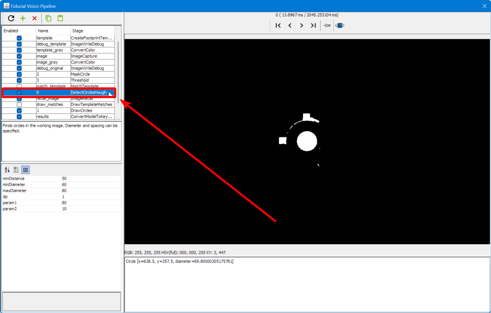

# Homing Fiducial Pipeline ([Video Guide](https://youtu.be/RVMS6vJzJyU?si=-dzIkANilr8o8j56&t=18))

If you receive the error message `FIDUCIAL-HOME no matches found` when homing your LumenPnP, you likely need to adjust your homing vision pipeline. Follow the steps below for a guide on the iterative approach.

  

## Open the Pipeline

1. Click on the `Machine Setup` tab in the top right pane.

    

2. Click on the "Expand" checkbox if necessary.

    

3. Click on `Heads > ReferenceHead H1`.

    

4. Click on the "Position Camera over location" icon button show below. This will move the top camera to where your datum board is mounted.

    

5. Confirm that your top camera is positioned exactly over the homing fiducial.

    

6. Adjust the exposure of your camera image as mentioned in the [Homing Fiducial Section](../calibration/4-homing-fiducial/index.md#double-check-camera-exposure).

7. Go to the `Vision` tab.

    

8. Select on `FiducialVision` from the type dropdown.

    

9. Select `- Default Machine Fiducial Locator -` from the pipeline list.

    

10. Click on Pipeline `Edit`.

    

## Edit the pipeline

This window is where you can edit the vision pipeline to detect your homing fiducial. The homing fiducial is detected using circular symmetry. The previous method was by thresholding the image and detecting a circle. We outline both methods on this page for posterity, but we recommend using the circular symmetry method.

### Circular symmetry method

!!! warning "Check your pipeline version"

      If your vision pipeline doesn't look like the image below, you still have the old version of detecting the homing fiducial. You can easily update your vision pipeline as follows.

      

      1. Click the "Copy" button in the code block below to save the vision pipeline to your clipboard.

        ```xml
        <cv-pipeline>
            <stages>
                <cv-stage class="org.openpnp.vision.pipeline.stages.ImageCapture" name="image" enabled="true" default-light="true" settle-first="true" count="1"/>
                <cv-stage class="org.openpnp.vision.pipeline.stages.MaskCircle" name="mask" enabled="true" diameter="500" property-name="MaskCircle"/>
                <cv-stage class="org.openpnp.vision.pipeline.stages.DetectCircularSymmetry" name="cir" enabled="true" min-diameter="10" max-diameter="150" max-distance="250" search-width="0" search-height="0" max-target-count="1" min-symmetry="1.2" corr-symmetry="0.0" property-name="" outer-margin="0.2" inner-margin="0.4" sub-sampling="8" super-sampling="1" diagnostics="true" heat-map="true"/>
                <cv-stage class="org.openpnp.vision.pipeline.stages.ConvertModelToKeyPoints" name="results" enabled="true" model-stage-name="cir"/>
            </stages>
        </cv-pipeline>
        ```

      1. Click the "Clipboard" icon in the vision pipeline window to insert the new pipeline into OpenPnP.

          

1. Check the output of the `mask` stage of the pipeline. This stage "masks" off extra parts of the image by turning all the pixels black. This reduces the chance that the pipeline will find a different circle in the image and detect it as the homing fiducial. Click on this stage to view its settings.

    1. There's only one property to adjust in this stage called `diameter`. A diameter too large could allow other potential circles into the image and could be erroneously detected by the pipeline. A diameter too small could potentially clip the actual homing fiducial if the first position capture isn't perfectly centered on the homing fiducial.

    

2. Check the output of the `cir` stage of the pipeline. This stage looks for circular symmetry in the image, and outputs a colored heatmap showing where it thinks the center of circular symmetry is. The goal is to have this stage put the brightest, most yellow point of the heatmap in the center of the homing fiducial. Click on this stage to view its settings.

    1. You can tell if OpenPnP is detecting circular symmetry if there's line of text similar to `Circle [x=639.5, y=361.5, diameter=78.0, score=133.06040353848752]` in the field in the bottom right of the window. This means OpenPnP found circular symmetry, and it tells you about the circle that it found. If there isn't a row here, it means the pipeline isn't detecting a circle.
    

    2. If the pipeline isn't finding a circle, you might need to adjust the max diameter circle that the pipeline can find. Increase the value for `maxDiameter` to tell the stage to accept found circles of a larger diameter.

### Circle detection method

!!! warning "Legacy Method"
    If your pipeline looks like this, we recommend you switch to the [circle symmetry method](#circular-symmetry-method).

1. Click on the `DrawCircles` stage.
  

1. The main view will show a circle if OpenPnP was able to identify what it thinks is the homing fiducial.
    1. If there are more than one circle, then we need to more clearly distinguish the real homing fiducial.
    2. If there is one circle, but it is not correctly drawn around the homing fiducial, then we need to more clearly distinguish the homing fiducial.
    3. If there are no circles, we need to loosen the filtering to make the real homing fiducial easier to identify.
    4. If the image looks like the good one above, your pipeline is properly tuned. If you've still been getting failures when homing, you may need to slightly loosen the filtering.

#### Adjust Pipeline

1. Click on the `Threshold` stage
  

2. Raise or lower the `threshold` parameter as necessary until the image is precise.
    1. If the image is too black, raise the `threshold` setting.
    2. If the image is too bright, lower the `threshold` setting.

3. Click on the `DrawCircles` stage and check if the fiducial has been correctly identified.
  

4. If not, pin the view of the `DrawCircles` stage.
  

5. Click on the `DetectCirclesHough` stage.
  

6. Raise or lower the `param2` parameter as necessary until the correct number of circles are identified.
    1. If there are no circles, lower the `param2` setting.
    2. If there are too many circles, raise the `param2` setting.
<!-- TODO: Photo shop image -->
#### Review Pipeline Output

1. When the fiducial is correctly identified, close the pipeline editor.
  

2. When prompted, save the edits you've made.
  

3. Try homing the machine to see if it can identify the homing fiducial.
  

4. If you receive the same `FIDUCIAL-HOME no matches found` error, you'll need to keep tuning your pipeline. Go back to [checking the debug results](#check-the-debug-results).
  
