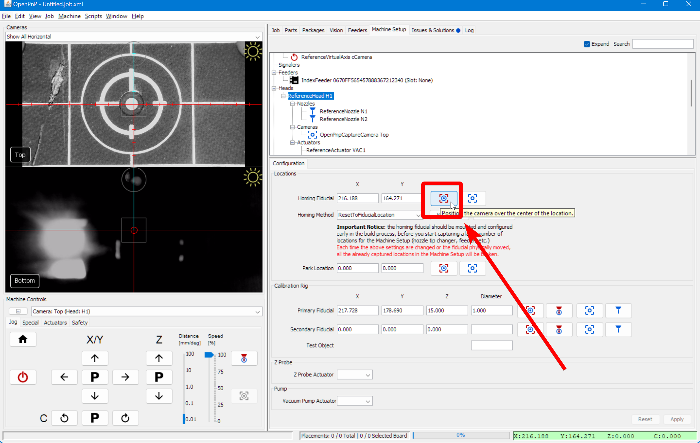
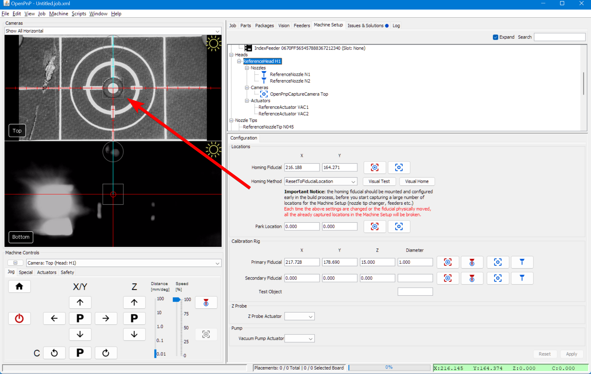
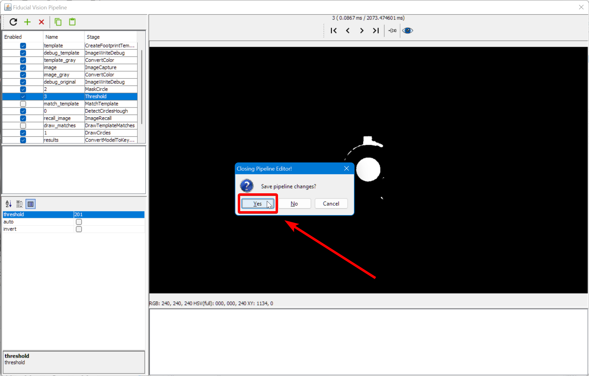
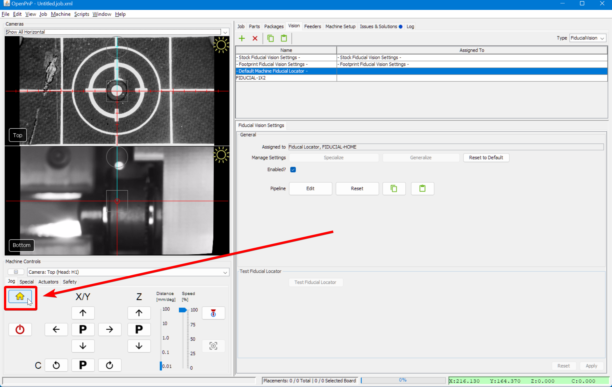

# Homing Fiducials Pipeline

If you receive the error message `FIDUCIAL-HOME no matches found` when homing your LumenPnP, you likely need to adjust your homing vision pipeline. Follow the steps below for a guide on the iterative approach. See also our [setup video](https://youtube.com/watch?v=CSnczX6VJ7M&si=EnSIkaIECMiOmarE&t=1210).

## Open the Pipeline

1. Click on the `Machine Setup` tab in the top right pane.
  

2. Click on the "Expand" checkbox if necessary.
  

3. Click on `Heads > ReferenceHead H1`.
  

4. Click on the "Position Camera over location" icon button show below. This will move the top camera to where your datum board is mounted.
  

5. Confirm that your top camera is positioned exactly over the homing fiducial.
  

6. Adjust the exposure of your camera image as mentioned in the [Homing Fiducial Section](../calibration/4-homing-fiducial/index.md#double-check-camera-exposure).

7. Go to the `Vision` tab.
  

8. Select on `FiducialVision` from the type dropdown.
  

9. Select `- Default Machine Fiducial Locator -` from the pipeline list.
  

10. Click on Pipeline `Edit`.
  

## Check the debug results

1. Click on the `DrawCircles` stage.
  

2. The main view will show a circle if OpenPnP was able to identify what it thinks is the homing fiducial.
    1. If there are more than one circle, then we need to more clearly distinguish the real homing fiducial.
    2. If there is one circle, but it is not correctly drawn around the homing fiducial, then we need to more clearly distinguish the homing fiducial.
    3. If there are no circles, we need to loosen the filtering to make the real homing fiducial easier to identify.
    4. If the image looks like the good one above, your pipeline is properly tuned. If you've still been getting failures when homing, you may need to slightly loosen the filtering.

## Adjust Pipeline

1. Click on the `Threshold` stage
  

2. Raise or lower the `threshold` parameter as necessary until the image is precise.
    1. If the image is too black, raise the `threshold` setting.
    2. If the image is too bright, lower the `threshold` setting.

3. Click on the `DrawCircles` stage and check if the fiducial has been correctly identified.
  

4. If not, pin the view of the `DrawCircles` stage.
  

5. Click on the `DetectCirclesHough` stage.
  

6. Raise or lower the `param2` parameter as necessary until the correct number of circles are identified.
    1. If there are no circles, lower the `param2` setting.
    2. If there are too many circles, raise the `param2` setting.
<!-- TODO: Photo shop image -->
## Review Pipeline Output

1. When the fiducial is correctly identified, close the pipeline editor.
  

2. When prompted, save the edits you've made.
  

3. Try homing the machine to see if it can identify the homing fiducial.
  

4. If you receive the same `FIDUCIAL-HOME no matches found` error, you'll need to keep tuning your pipeline. Go back to [Check  the debug results](#check-the-debug-results)
  
