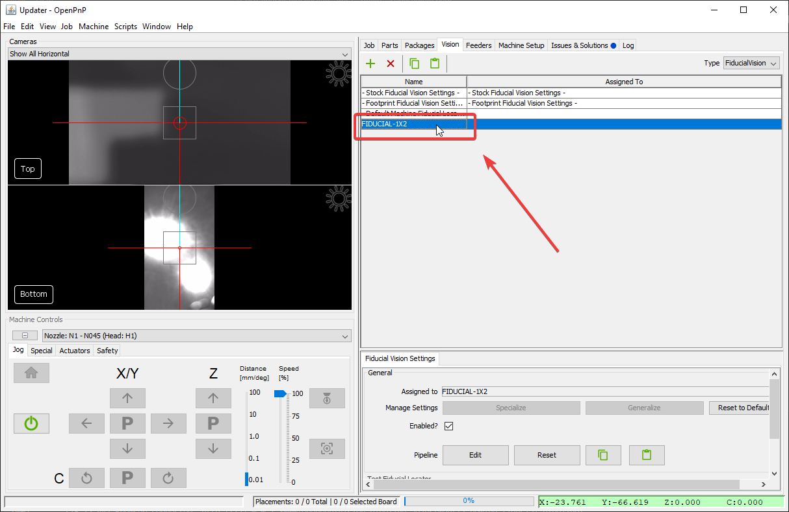
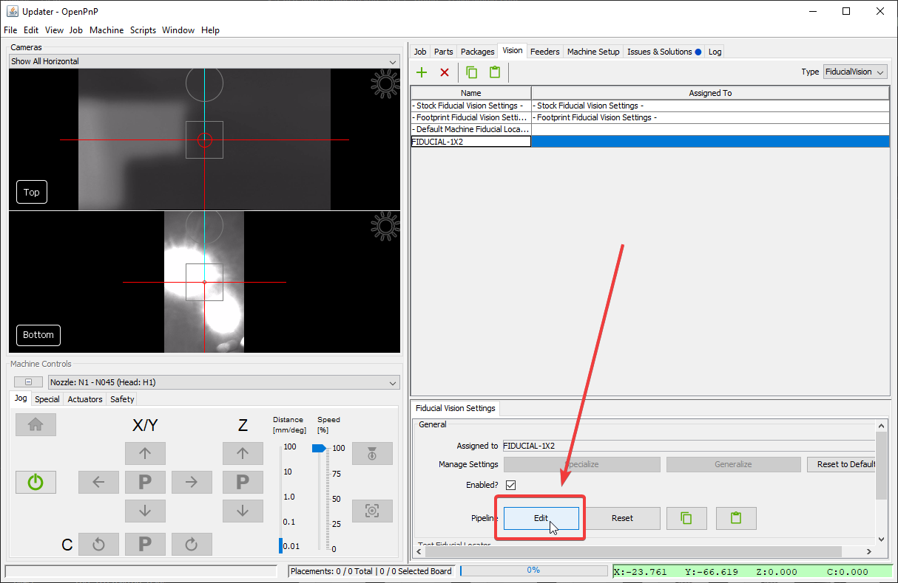

# PCB Fiducials

Just like the homing fiducial, you'll use fiducial markers to identify the exact location of your boards. Tuning them is the same process, just in a different place in the OpenPnP UI.

1. Go to the `Vision` tab.
  

2. Select on `FiducialVision` from the type dropdown.
  

3. Select `FIDUCIAL-1X2` from the pipeline list.
  

4. Click on Pipeline `Edit`.
  

5. Continue with the same procedure as the [Homing Fiducial Pipeline](2-homing-fiducial-pipeline.md#check-the-debug-results) section.
