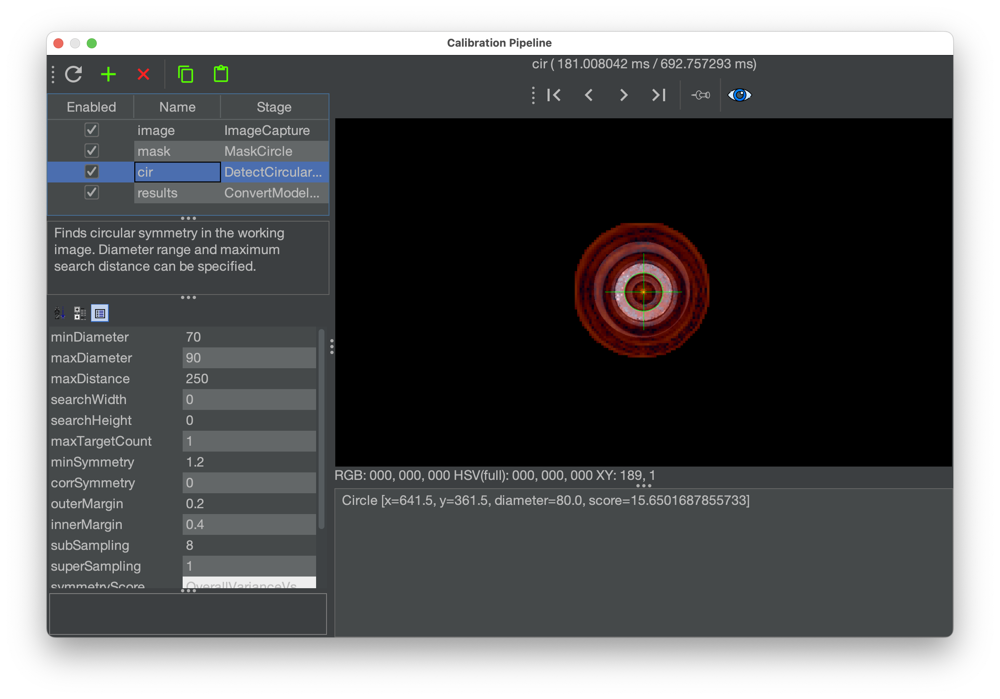
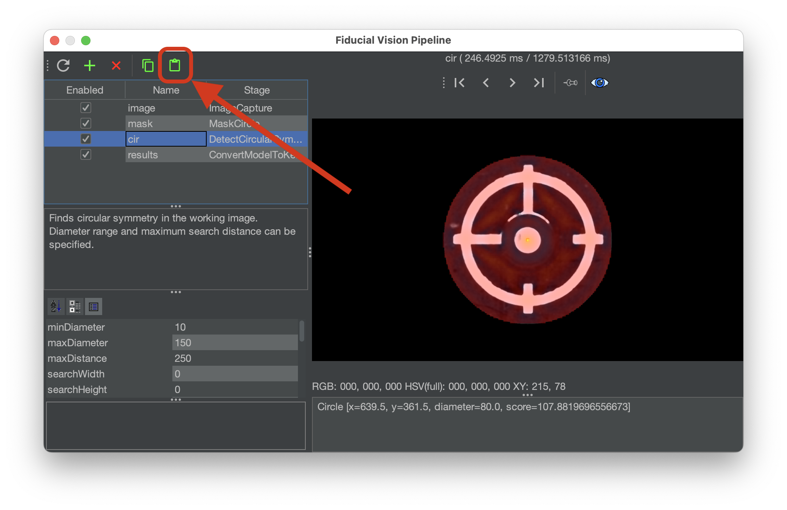
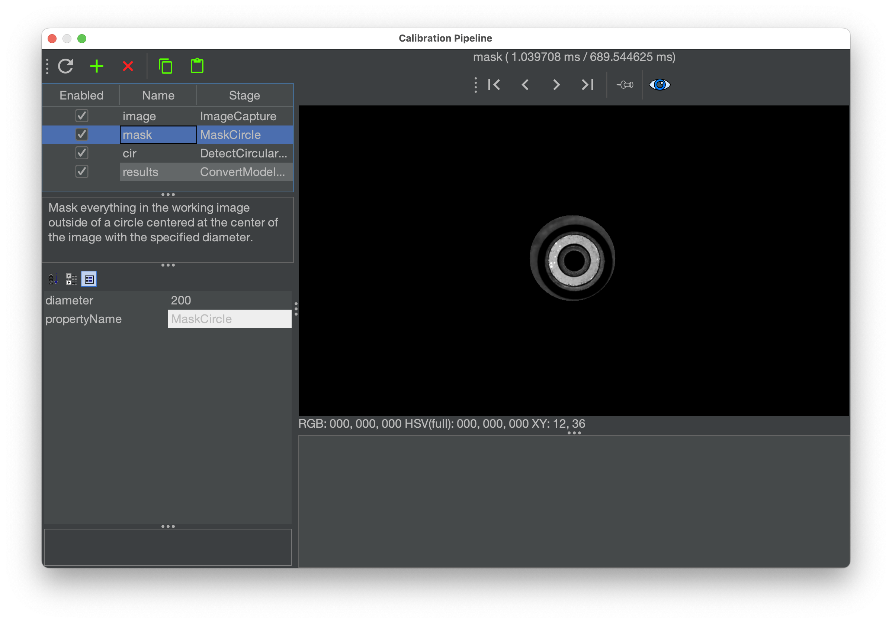

# Nozzle Calibration Pipeline ([Video Guide](https://youtu.be/RVMS6vJzJyU?si=c-ta9EFDhIMdvlam&t=249))

If you receive the error message `Nozzle tip calibration: not enough results from vision. Check pipeline and threshold` when homing your LumenPnP, you likely need to adjust your nozzle tip calibration pipeline. Follow the steps below for a guide on the iterative approach. See also our [setup video](https://youtube.com/watch?v=CSnczX6VJ7M&si=EnSIkaIECMiOmarE&t=1875).

  

## Position Nozzle Over Bottom Camera

1. Install a nozzle tip on your first toolhead. In this example we'll work with the N045 nozzle tip.
  
    

2. Click on the `Machine Setup` tab in the top right pane.
  
    

3. Click on the "Expand" checkbox.
  
    

4. Click on `Heads > ReferenceHead H1 > Nozzles > ReferenceNozzle N1`
  
    

5. Click on the `Nozzle Tips` tab.
  
    

1. Click the `Loaded?` checkbox for the nozzle you're tuning.
  
    

1. Click on `Nozzle Tips > ReferenceNozzleTip N045` (or whichever nozzle you're tuning).
  
    

1. Click on the `Calibration` tab.
  
    

1. Home your LumenPnP to make sure your toolhead's location is accurate. Ignore the `Nozzle tip calibration: not enough results from vision. Check pipeline and threshold` error if it appears.
  
    

1.  Select the `Nozzle: N1 - N045 (Head:H1)` from the machine controls dropdown (or whichever tip you're tuning).
  
    

1.  Click the "Position tool over location" button to bring the left nozzle above the bottom camera.
  
    

1.  Click on Pipeline `Edit`.

    

## Edit the pipeline

### Circular symmetry method

!!! warning "Check your pipeline version"

      If your vision pipeline doesn't look like the image below, you still have the old version of detecting nozzle tips. You can easily update your vision pipeline as follows.

      

      1. Click the "Copy" button in the code block below for the relevant nozzle tip to save the vision pipeline to your clipboard.

        === "N045"
            ```xml
            <cv-pipeline>
              <stages>
                  <cv-stage class="org.openpnp.vision.pipeline.stages.ImageCapture" name="image" enabled="true" default-light="true" settle-option="Settle" count="1"/>
                  <cv-stage class="org.openpnp.vision.pipeline.stages.MaskCircle" name="mask" enabled="true" diameter="100" property-name="MaskCircle"/>
                  <cv-stage class="org.openpnp.vision.pipeline.stages.DetectCircularSymmetry" name="cir" enabled="true" min-diameter="5" max-diameter="25" max-distance="250" search-width="0" search-height="0" max-target-count="1" min-symmetry="1.2" corr-symmetry="0.0" outer-margin="0.2" inner-margin="0.4" sub-sampling="8" super-sampling="1" symmetry-score="OverallVarianceVsRingVarianceSum" property-name="" diagnostics="true" heat-map="true"/>
                  <cv-stage class="org.openpnp.vision.pipeline.stages.ConvertModelToKeyPoints" name="results" enabled="true" model-stage-name="cir"/>
              </stages>
            </cv-pipeline>
            ```

        === "N08"
            ```xml
            <cv-pipeline>
              <stages>
                  <cv-stage class="org.openpnp.vision.pipeline.stages.ImageCapture" name="image" enabled="true" default-light="true" settle-option="Settle" count="1"/>
                  <cv-stage class="org.openpnp.vision.pipeline.stages.MaskCircle" name="mask" enabled="true" diameter="200" property-name="MaskCircle"/>
                  <cv-stage class="org.openpnp.vision.pipeline.stages.DetectCircularSymmetry" name="cir" enabled="true" min-diameter="20" max-diameter="35" max-distance="250" search-width="0" search-height="0" max-target-count="1" min-symmetry="2.0" corr-symmetry="0.0" outer-margin="0.2" inner-margin="0.4" sub-sampling="8" super-sampling="1" symmetry-score="OverallVarianceVsRingVarianceSum" property-name="" diagnostics="true" heat-map="true"/>
                  <cv-stage class="org.openpnp.vision.pipeline.stages.ConvertModelToKeyPoints" name="results" enabled="true" model-stage-name="cir"/>
              </stages>
            </cv-pipeline>
            ```

        === "N14"
            ```xml
            <cv-pipeline>
              <stages>
                  <cv-stage class="org.openpnp.vision.pipeline.stages.ImageCapture" name="image" enabled="true" default-light="true" settle-option="Settle" count="1"/>
                  <cv-stage class="org.openpnp.vision.pipeline.stages.MaskCircle" name="mask" enabled="true" diameter="200" property-name="MaskCircle"/>
                  <cv-stage class="org.openpnp.vision.pipeline.stages.DetectCircularSymmetry" name="cir" enabled="true" min-diameter="35" max-diameter="55" max-distance="250" search-width="0" search-height="0" max-target-count="1" min-symmetry="1.2" corr-symmetry="0.0" outer-margin="0.2" inner-margin="0.4" sub-sampling="8" super-sampling="1" symmetry-score="OverallVarianceVsRingVarianceSum" property-name="" diagnostics="true" heat-map="true"/>
                  <cv-stage class="org.openpnp.vision.pipeline.stages.ConvertModelToKeyPoints" name="results" enabled="true" model-stage-name="cir"/>
              </stages>
            </cv-pipeline>
            ```

        === "N24"
            ```xml
            <cv-pipeline>
              <stages>
                  <cv-stage class="org.openpnp.vision.pipeline.stages.ImageCapture" name="image" enabled="true" default-light="true" settle-option="Settle" count="1"/>
                  <cv-stage class="org.openpnp.vision.pipeline.stages.MaskCircle" name="mask" enabled="true" diameter="200" property-name="MaskCircle"/>
                  <cv-stage class="org.openpnp.vision.pipeline.stages.DetectCircularSymmetry" name="cir" enabled="true" min-diameter="70" max-diameter="90" max-distance="250" search-width="0" search-height="0" max-target-count="1" min-symmetry="1.2" corr-symmetry="0.0" outer-margin="0.2" inner-margin="0.4" sub-sampling="8" super-sampling="1" symmetry-score="OverallVarianceVsRingVarianceSum" property-name="" diagnostics="true" heat-map="true"/>
                  <cv-stage class="org.openpnp.vision.pipeline.stages.ConvertModelToKeyPoints" name="results" enabled="true" model-stage-name="cir"/>
              </stages>
            </cv-pipeline>
            ```

        === "N40"
            ```xml
            <cv-pipeline>
              <stages>
                  <cv-stage class="org.openpnp.vision.pipeline.stages.ImageCapture" name="image" enabled="true" default-light="true" settle-option="Settle" count="1"/>
                  <cv-stage class="org.openpnp.vision.pipeline.stages.MaskCircle" name="mask" enabled="true" diameter="200" property-name="MaskCircle"/>
                  <cv-stage class="org.openpnp.vision.pipeline.stages.DetectCircularSymmetry" name="cir" enabled="true" min-diameter="40" max-diameter="85" max-distance="250" search-width="0" search-height="0" max-target-count="1" min-symmetry="1.2" corr-symmetry="0.0" outer-margin="0.2" inner-margin="0.4" sub-sampling="8" super-sampling="1" symmetry-score="OverallVarianceVsRingVarianceSum" property-name="" diagnostics="true" heat-map="true"/>
                  <cv-stage class="org.openpnp.vision.pipeline.stages.ConvertModelToKeyPoints" name="results" enabled="true" model-stage-name="cir"/>
              </stages>
            </cv-pipeline>
            ```

        === "N75"
            ```xml
            <cv-pipeline>
              <stages>
                  <cv-stage class="org.openpnp.vision.pipeline.stages.ImageCapture" name="image" enabled="true" default-light="true" settle-option="Settle" count="1"/>
                  <cv-stage class="org.openpnp.vision.pipeline.stages.MaskCircle" name="mask" enabled="true" diameter="200" property-name="MaskCircle"/>
                  <cv-stage class="org.openpnp.vision.pipeline.stages.DetectCircularSymmetry" name="cir" enabled="true" min-diameter="40" max-diameter="70" max-distance="250" search-width="0" search-height="0" max-target-count="1" min-symmetry="1.2" corr-symmetry="0.0" outer-margin="0.2" inner-margin="0.4" sub-sampling="8" super-sampling="1" symmetry-score="OverallVarianceVsRingVarianceSum" property-name="" diagnostics="true" heat-map="true"/>
                  <cv-stage class="org.openpnp.vision.pipeline.stages.ConvertModelToKeyPoints" name="results" enabled="true" model-stage-name="cir"/>
              </stages>
            </cv-pipeline>
            ```


      2.  Open the pipeline for nozzle tip you just copied the code for, and click the "Clipboard" icon in the vision pipeline window to insert the new pipeline into OpenPnP.

          

1. Check the output of the `mask` stage of the pipeline. This stage "masks" off extra parts of the image by turning all the pixels black. This reduces the chance that the pipeline will find a different circle in the image and detect it as the homing fiducial. Click on this stage to view its settings.

    1. There's only one property to adjust in this stage called `diameter`. A diameter too large could allow other potential circles into the image and could be erroneously detected by the pipeline. A diameter too small could potentially clip the actual homing fiducial if the first position capture isn't perfectly centered on the homing fiducial.

      

2. Check the output of the `cir` stage of the pipeline. This stage looks for circular symmetry in the image, and outputs a colored heatmap showing where it thinks the center of circular symmetry is. The goal is to have this stage put the brightest, most yellow point of the heatmap in the center of the homing fiducial. Click on this stage to view its settings.

    1. You can tell if OpenPnP is detecting circular symmetry if there's line of text similar to `Circle [x=639.5, y=361.5, diameter=78.0, score=133.06040353848752]` in the field in the bottom right of the window. This means OpenPnP found circular symmetry, and it tells you about the circle that it found. If there isn't a row here, it means the pipeline isn't detecting a circle. Try increasing the `maxDiameter` and decreasing the `minDiameter` until you get a circle.
    
      

    2. If the pipeline isn't finding a circle, you might need to adjust the max diameter circle that the pipeline can find. Increase the value for `maxDiameter` to tell the stage to accept found circles of a larger diameter.

### Detect Circles Method (Legacy)

!!! warning "Legacy Method"
    If your pipeline looks like this, we recommend you switch to the [circle symmetry method](#circular-symmetry-method).

#### Stage Breakdown


1. Stages 0-4 pre-process the image from the camera to make the tip of the nozzle clearer. Their goal is to outline the tip of the nozzle on its own so that it's exact position can be calculated. Of these stages, #3, `Threshold` is the most useful to tune. (See below for details)
2. The Results stage, `DetectCirclesHough`, takes the highlighted nozzle tip and calculates it's exact location by fitting a perfect circle to the tip. It's important that this calculation be reliable and repeatable. It's also important not to have extra erroneous circles detected, which could throw off the nozzle tip calibration and lead to imprecise picking.
3. Stages 5-7 are for debugging and showing you visually the output of the Results Stage. The most useful stage here is the #6 `DrawCircles` stage. After adjusting a setting, review the `DrawCircles` stage and check if the fiducial has been correctly identified.

!!! Tip
    It may be helpful to pin the `DrawCircles` stage so you can see the results of the pipeline. This saves you having to click back and forth between stages while making adjustments.
    

#### General Strategy

For the most reliable identification of nozzle tips, you should tune the vision pipeline so that it can identify the internal hole of the nozzle tip, not the edge of the nozzle tip.


1. If there is more than one circle detected, then we need to more clearly distinguish the real nozzle tip.
2. If there is one circle, but it is not correctly drawn around the nozzle tip hole, then we need to more clearly distinguish the hole.
3. If there are no circles, we need to loosen the filtering to make the nozzle tip easier to identify.
4. If the image looks like the good one above, your pipeline is properly tuned. If you've still been getting failures when homing, you may need to slightly loosen the filtering.

You will need to take an iterative approach to tune your vision pipeline. Because your machine's cameras and lighting conditions are unique, there is unfortunately no one-size-fits-all solution here. Make small changes and track how they affect the identification of the tip of your nozzle.

!!! Note "Check the Debug Results"
    Unlike [homing fiducial tuning](2-homing-fiducial-pipeline.md), nozzle tip tuning needs to be able to identify the nozzle multiple times as it is rotated. This can make it slightly trickier to see the issues with your calibration pipeline. You may need to run a round of calibration and watch the results live to see which orientation of the toolhead gives the pipeline the most trouble. You can also increase the `Allowed Misdetects` option if you're getting good picking results, but homing still fails occasionally.
    

#### Threshold Tuning

The `Threshold` stage is the most commonly edited stage. It turns the camera image into black and white, which starkly defines the tip of your nozzle. It is important that the inner hole of your nozzle is a clear white circle after this step. Raise or lower the `threshold` parameter as necessary until the image is precise. Note that the `invert` button is checked so that the nozzle tip hole is shown in white for the next steps.

* If the image is too dark, raise the `threshold` setting.
* If the image is too bright, lower the `threshold` setting.


#### DetectCirclesHough Tuning

`DetectCirclesHough` is the other commonly edited stage. You'll need to experiment with the following adjustments:

`param2` adjusts how likely the algorithm will be to detect a circle.

1. If there are no circles, lower the `param2` setting.
2. If there are too many circles, raise the `param2` setting.


Depending on your nozzle tip, may also need to adjust the `maxDiameter` setting.

1. Raise the `maxDiameter` setting if there are no circles detected at all after adjusting the other settings.
2. Lower the `maxDiameter` setting if very large circles are drawn around noise in the image.


#### BlurMedian Tuning

`BlurMedian` can be useful if there are debris blocking the inner hole of your nozzle tip. That debris can cause the round silhouette of the hole to be interrupted and not be identified by the `DetectCirclesHough` stage. Use `BlurMedian` to remove artifacts in the photo, but don't blur so much that you significantly change the silhouette of the nozzle.


1. Raise the `kernelSize` if the center of your nozzle tip doesn't make a perfect circle.
2. Lower the `kernelSize` if the center of your nozzle tip is distorted from too much blur.
