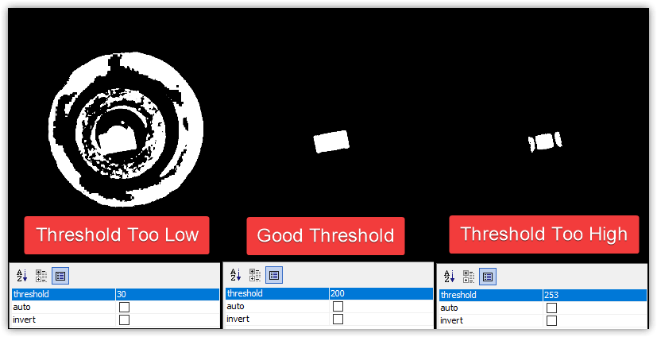

# Part Identification Pipeline ([Video Guide](https://youtu.be/RVMS6vJzJyU?si=rRQs_61cFfH24sVC&t=432))

Part identification is the most difficult pipeline to tune because it needs to accomodate every part in your job.

If you receive an error after picking a component about `No Results Found`, you need to tune your vision pipeline.


## Setup nozzle

1. Install a nozzle tip on your first toolhead. In this example we'll work with the N045 nozzle tip.

    

2. Click on the `Machine Setup` tab in the top right pane.

    

3. Click on the "Expand" checkbox.

    

4. Click on `Heads > ReferenceHead H1 > Nozzles > ReferenceNozzle N1`

    

5. Click on the `Nozzle Tips` tab.

    

6. Click the `Loaded?` checkbox for the nozzle you're tuning.

    

7. Click on `Nozzle Tips > ReferenceNozzleTip N045` (or whichever nozzle you're working with).

    

8. Check that the correct toolhead is selected in the `Machine Controls Tab`.

    

## Pick component

To tune a part identification pipeline, you'll need to pick up the component you want to tune. You can [setup a feeder](../ftp/1-installing-the-feeders/index.md) and use the "pick" button.


## Open the pipeline

1. With a part now picked and on the nozzle, go to the `Packages` tab.

    

2. Select the package for the component you'll be tuning.

    

3. Check that your nozzle tip is compatible with the package you'll be working with.

    

4. Click on the `Bottom Vision Settings Tab`.

    

5. Click on the Pipeline: `Edit` button.

    

    !!! warning "Affects all other parts"

        Directly clicking the "Edit" button will adjust the vision pipeline for **every other package assigned to this pipeline**. If you'd like to adjust the pipeline for **just** this package, click on the "Specialize for `PACKAGE_NAME`" button before editing.

1. Allow OpenPnP to jog the nozzle to the bottom camera position.

## Edit the pipeline

!!! warning "Reset pipeline to default"

      If you want to reset your part identification pipeline to the clean default configuration, you can easily update your vision pipeline as follows.

      

      1. Click the "Copy" button in the code block below to save the vision pipeline to your clipboard.

          ```xml
          <cv-pipeline>
            <stages>
                <cv-stage class="org.openpnp.vision.pipeline.stages.ImageCapture" name="CaptureImage" enabled="true" default-light="true" settle-option="Settle" count="1"/>
                <cv-stage class="org.openpnp.vision.pipeline.stages.ImageWriteDebug" name="SaveDebugImage" enabled="false" prefix="bv_source_" suffix=".png"/>
                <cv-stage class="org.openpnp.vision.pipeline.stages.MaskCircle" name="MaskCircle" enabled="true" diameter="250" property-name=""/>
                <cv-stage class="org.openpnp.vision.pipeline.stages.ConvertColor" name="ConvertToGray" enabled="true" conversion="Bgr2Gray"/>
                <cv-stage class="org.openpnp.vision.pipeline.stages.BlurGaussian" name="InitialBlur" enabled="true" kernel-size="9" property-name="BlurGaussian"/>
                <cv-stage class="org.openpnp.vision.pipeline.stages.Threshold" name="Threshold" enabled="true" threshold="230" auto="false" invert="false"/>
                <cv-stage class="org.openpnp.vision.pipeline.stages.BlurGaussian" name="SecondBlur" enabled="true" kernel-size="3" property-name="BlurGaussian"/>
                <cv-stage class="org.openpnp.vision.pipeline.stages.MinAreaRect" name="results" enabled="true" threshold-min="149" threshold-max="256" expected-angle="0.0" search-angle="45.0" left-edge="true" right-edge="true" top-edge="true" bottom-edge="true" diagnostics="false" property-name="MinAreaRect"/>
                <cv-stage class="org.openpnp.vision.pipeline.stages.ImageRecall" name="RecallOriginal" enabled="true" image-stage-name="CaptureImage"/>
                <cv-stage class="org.openpnp.vision.pipeline.stages.DrawRotatedRects" name="DrawRectangle" enabled="true" rotated-rects-stage-name="results" thickness="2" draw-rect-center="false" rect-center-radius="20" show-orientation="false"/>
                <cv-stage class="org.openpnp.vision.pipeline.stages.ImageWriteDebug" name="SaveDebugWithCV" enabled="false" prefix="bv_result_" suffix=".png"/>
            </stages>
          </cv-pipeline>
          ```

      2.  Click the "Clipboard" icon in the vision pipeline window to insert the new pipeline into OpenPnP.

          

1. Click on the `DrawRotatedRects` stage.

    

1. The main view will show a rectangle around the silhouette of your component.
    1. If the rectangle is not precise around your component, then we need to more clearly distinguish the real component from the toolhead.
    2. If there is no rectangle, we need to loosen the threshold to make the component easier to identify.
    3. If the image looks like the good one above, your pipeline is properly tuned. If you've still been getting failures when homing, you may need to slightly loosen the filtering.

## Threshold tuning

The `Threshold` stage is the most commonly edited stage. It turns the camera image into black and white, which starkly defines the tip of your nozzle. This is especially important for detecting parts, as they should catch all of the light from the upward facing camera LEDs and turn totally white in the image. We need to detect both the position and rotation of the picked component, so a tight, precise rectangle identifying its body is very important. Raise or lower the `threshold` parameter as necessary until the picked component is outlined precisely.

* If the image is too dark, lower the `threshold` setting.
* If the image is too bright, raise the `threshold` setting.

!!! danger "Exposure settings"
    If you're having trouble getting your image to look like the "Good Threshold" image below, it could be that your bottom camera exposure is too high, making it difficult for OpenPnP to distinguish between the part and the nozzle tip. [Adjust your bottom camera's exposure](/openpnp/calibration/8-nozzle-tip-calibration/nozzle-tip-calibration/), then retry tuning your threshold value.



## Test part identification

1. To see how your adjusted pipeline performs, click on the `Test Alignment` button.
  

!!! NOTE
    If you receive the `Part height unknown and camera Bottom does not support part height sensing.` error, you need to set your part's height. This lets OpenPnP position it appropriately above the bottom camera.

     1. Go to the `Parts Tab`
     2. Select your Component
     3. Double-click the Height Column to modify it.

    
    
