# Part Identification Pipeline

Part identification is the most difficult pipeline to tune because different parts will need special consideration. Even just for the normal components used in the [FTP](../ftp/index.md), you need to be sure that the picked components are distinguishable from the tip of your nozzle. Depending on how well you set your [camera exposure](../calibration/2-connect-to-machine/index.md#bottom-camera-config) and other settings, you may need to go back and adjust them, which, of course, would require that you re-tune your [nozzle tip pipeline](4-nozzle-calibration-pipeline.md) to account for the changes.

If you receive an error after picking a component about `No Results Found`, you need to tune your vision pipeline.

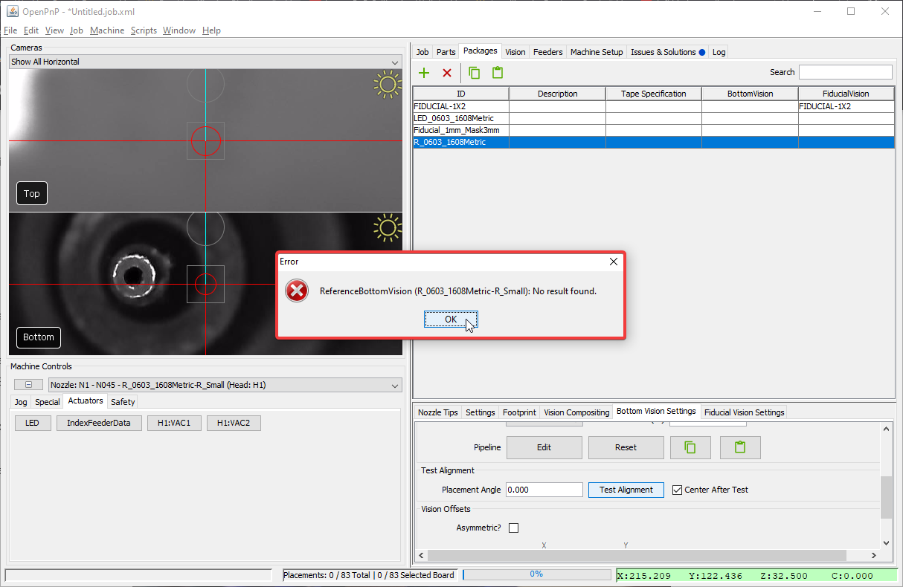

## Setup Nozzle

1. Install a nozzle tip on your first toolhead. In this example we'll work with the N045 nozzle tip.
  

2. Click on the `Machine Setup` tab in the top right pane.
  

3. Click on the "Expand" checkbox to open all of the features about your machine.
  

4. Click on `Heads > ReferenceHead H1 > Nozzles > ReferenceNozzle N1`
  

5. Click on the `Nozzle Tips` tab.
  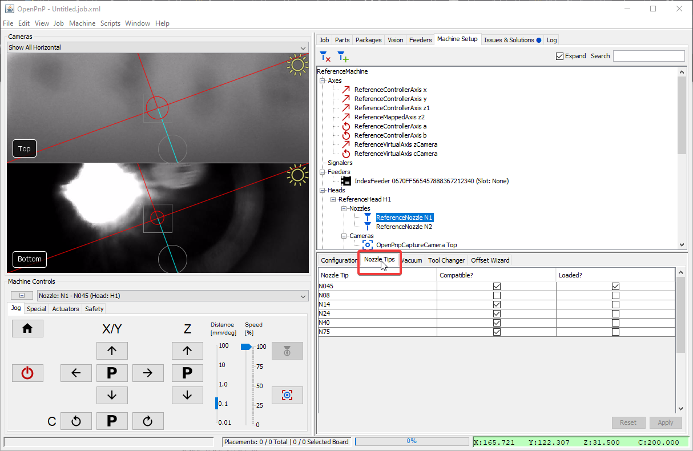

6. Click the `Loaded?` checkbox for the nozzle you're tuning.
  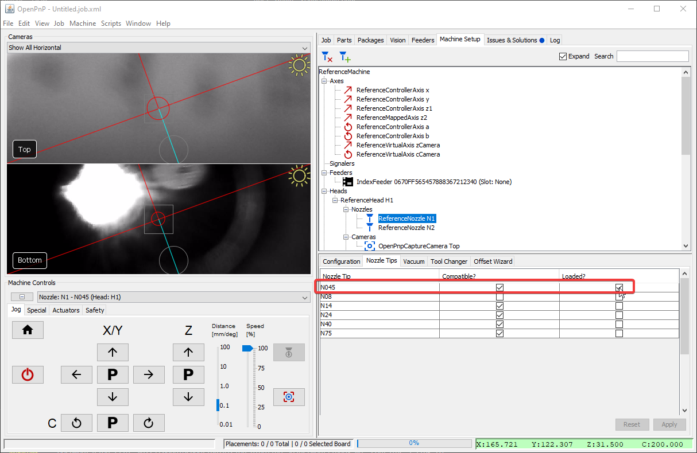

7. Click on `Nozzle Tips > ReferenceNozzleTip N045` (or whichever nozzle you're working with).
  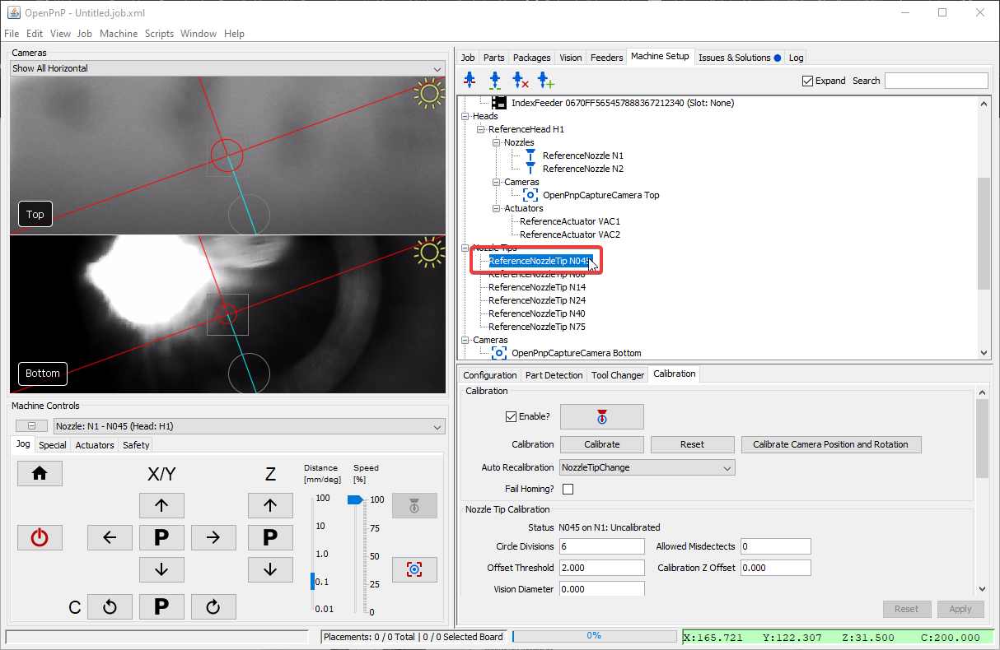

8. Check that the correct toolhead is selected in the `Machine Controls Tab`.
  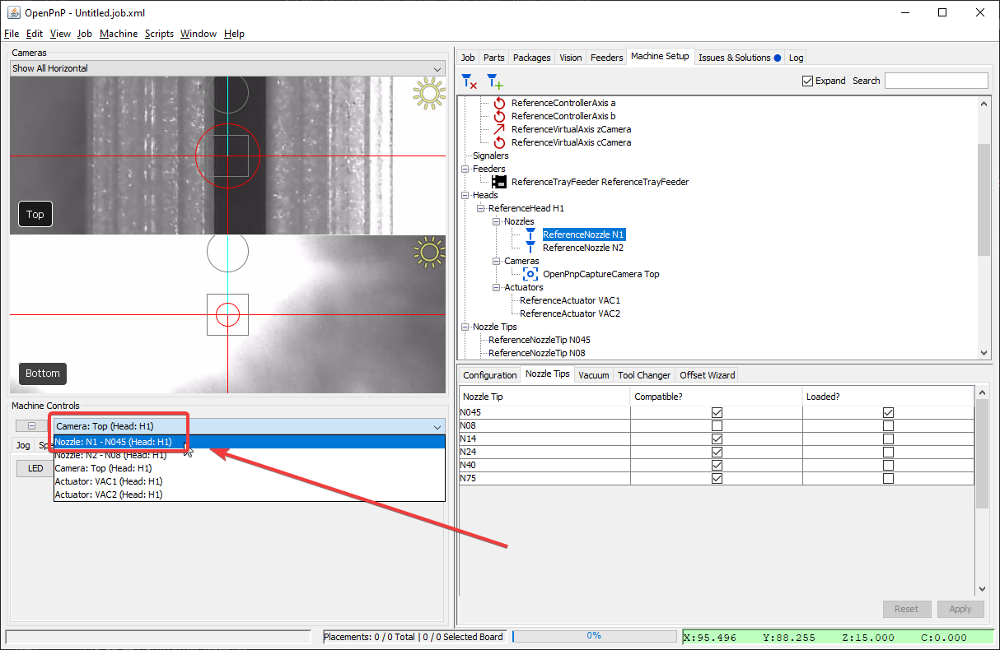

## Pickup Component

To tune a part identification pipeline, you'll need to pick up the component you want to tune. You can [setup a feeder](../ftp/1-installing-the-feeders/index.md) and use the "pick" button.

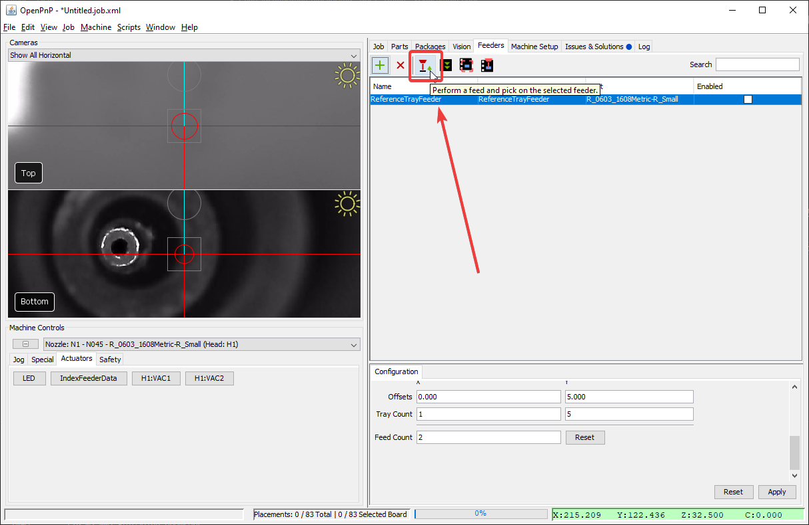

Alternatively, you can manually take a component and place it on your nozzle tip. To activate the nozzle's suction, use the `Actuators Tab > H1:VAC1 > Set Boolean Value > On`.
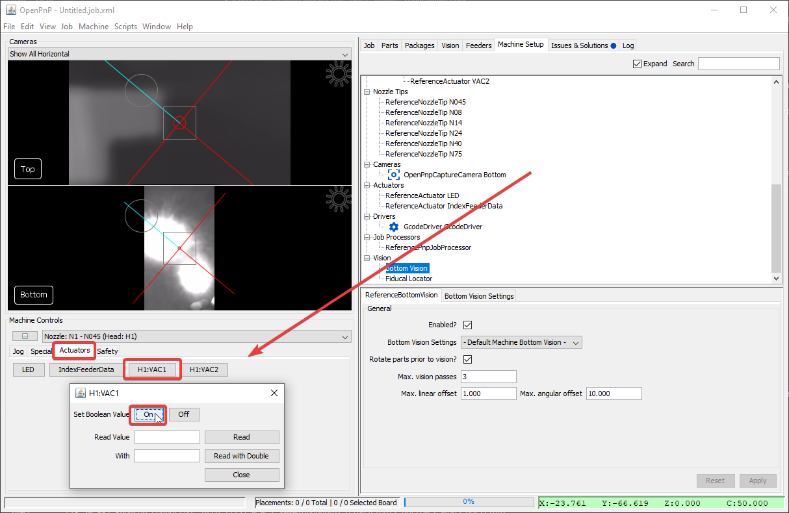

## Open the Pipeline

1. Go to the `Packages` tab.
  

2. Select the package for the component you'll be tuning. For example, the `R_0603_1608Metric` package used in the [Test Placement](../ftp/1-installing-the-feeders/index.md).
  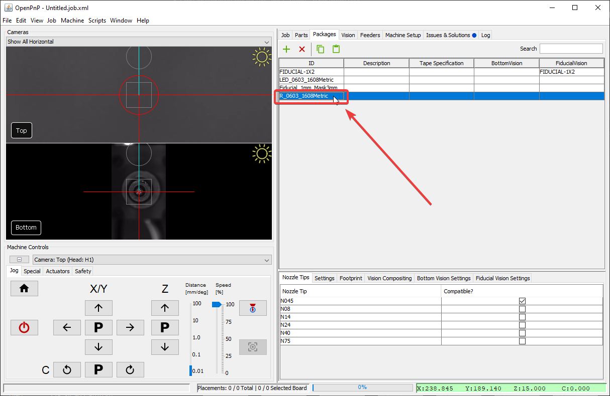

3. Check that your nozzle tip is compatible with the package you'll be working with.
  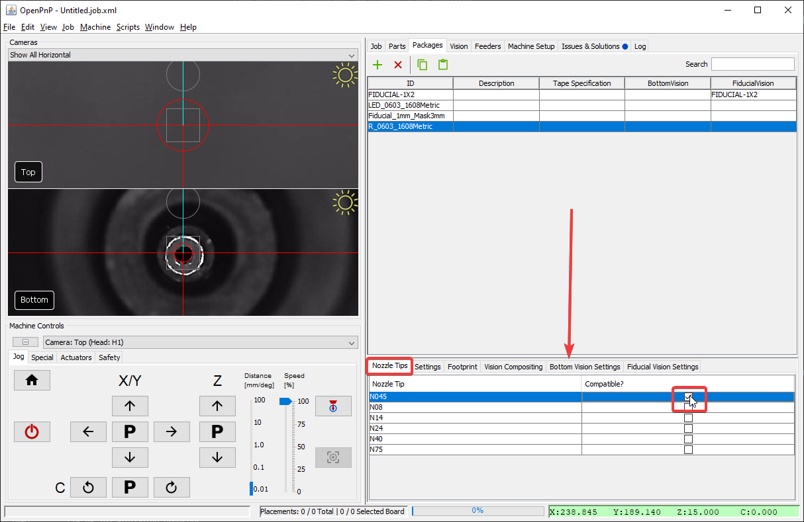

4. Click on the `Bottom Vision Settings Tab`.
  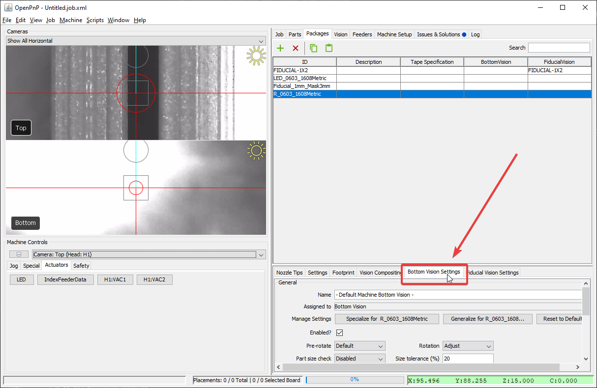

5. Click on the Pipeline: `Edit` button.
  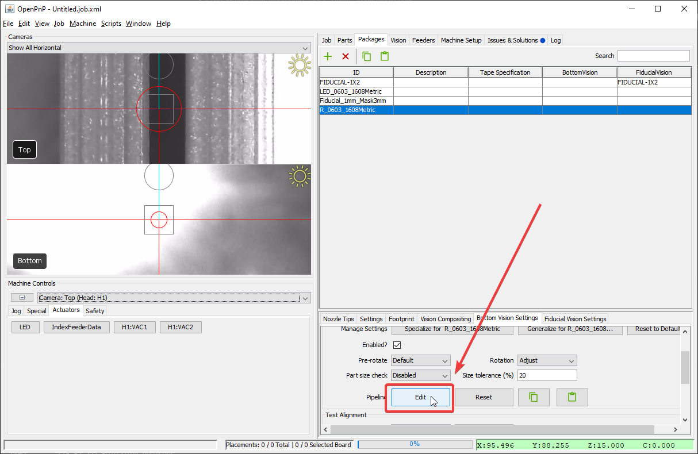

!!! Note
    You can also go to `Vision Tab > Type:Bottom Vision > The correct pipeline` and click on `Pipeline: Edit` to edit the pipeline.

## Check the debug results

1. Click on the `DrawRotatedRects` stage.
  

2. The main view will show a rectangle around the silhouette of your component.
    1. If the rectangle is not precise around your component, then we need to more clearly distinguish the real component from the toolhead.
    2. If there is no rectangle, we need to loosen the threshold to make the component easier to identify.
    3. If the image looks like the good one above, your pipeline is properly tuned. If you've still been getting failures when homing, you may need to slightly loosen the filtering.

## Threshold Tuning

The `Threshold` stage is the most commonly edited stage. It turns the camera image into black and white, which starkly defines the tip of your nozzle. This is especially important for detecting parts, as they should catch all of the light from the upward facing camera LEDs and turn totally white in the image. We need to detect both the position and rotation of the picked component, so a tight, precise rectangle identifying its body is very important. Raise or lower the `threshold` parameter as necessary until the picked component is outlined precisely.

* If the image is too dark, lower the `threshold` setting.
* If the image is too bright, raise the `threshold` setting.

## Test Part Identification

1. Go to the `Packages` tab.
  

2. Select the package for the component you'll be tuning. For example, the `R_0603_1608Metric` package used in the [Test Placement](../ftp/1-installing-the-feeders/index.md).
  

3. Click on the `Bottom Vision Settings Tab`.
  
  
4. Click on the `Test Alignment` button.
  

!!! NOTE
    If you receive the `Part height unknown and camera Bottom does not support part height sensing.` error, you need to set your part's height. This lets OpenPnP position it appropriately above the bottom camera.

     1. Go to the `Parts Tab`
     2. Select your Component
     3. Double-click the Height Column to modify it.

    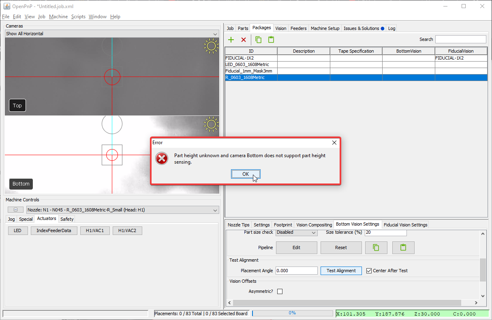
    
