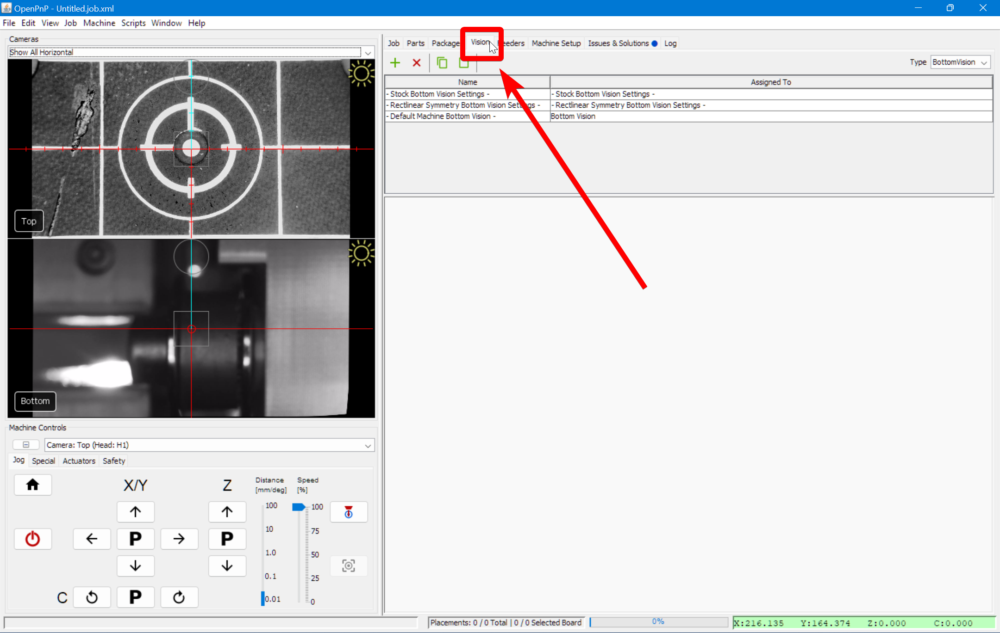
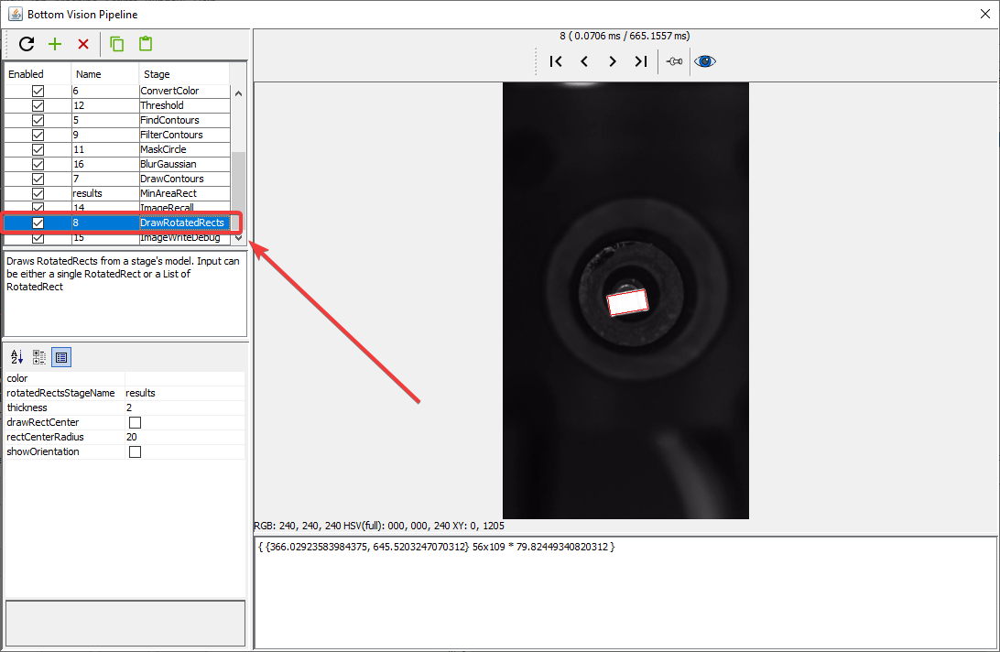
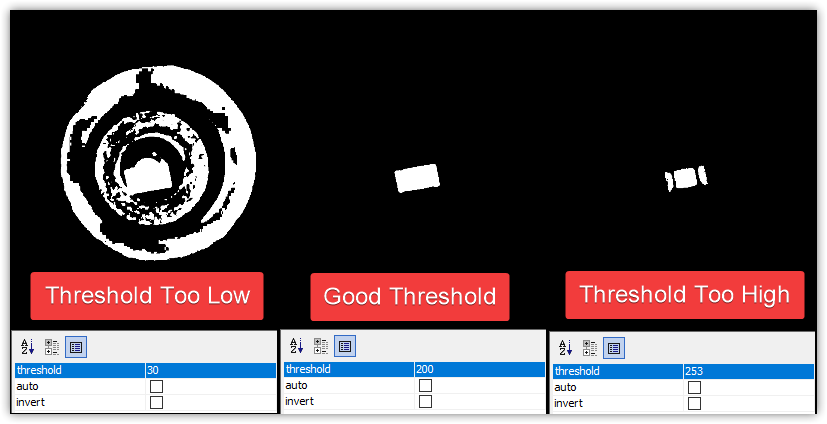

# Part Identification

Part identification is the most difficult pipeline to tune because different parts will need special consideration. Even just for the normal components used in the [FTP](../ftp/index.md), you need to be sure that the picked components are distinguishable from the tip of your nozzle. Depending on how well you set your [camera exposure](../calibration/2-connect-to-machine/index.md#bottom-camera-config) and other settings, you may need to go back and adjust them, which, of course, would require that you re-tune your[nozzle tip pipeline](4-nozzle-calibration-pipeline.md) to account for the changes.

## Open the Pipeline

TODO: Pick up a component for inspection

1. Go to the `Vision` tab.
  

1. Select on `BottomVision` from the type dropdown.
  

1. Select `- Default Machine Bottom Vision -` from the pipeline list.
  

1. Click on Pipeline `Edit`.
  

!!! Note
    You can also go to `Packages Tab > Your Package > Bottom VisionSettings` and click on `Pipeline: Edit` to find the relevant pipeline for your parts and to specialize them.

## Check the debug results

1. Click on the `DrawRotatedRects` stage.
  

1. The main view will show a rectangle around the silhouette of your component.
    1. If the rectangle is not precise around your component, then we need to more clearly distinguish the real component from the toolhead.
    2. If there is no rectangle, we need to loosen the threshold to make the component easier to identify.
    3. If the image looks like the good one above, your pipeline is properly tuned. If you've still been getting failures when homing, you may need to slightly loosen the filtering.

## Threshold Tuning

The `Threshold` stage is the most commonly edited stage. It turns the camera image into black and white, which starkly defines the tip of your nozzle. This is especially important for detecting parts, as they should catch all of the light from the upward facing camera LEDs and turn totally white in th image. We need to detect both the position and rotation of the picked component, so a tight, precise rectangle identifying its body is very important. Raise or lower the `threshold` parameter as necessary until the picked component is outlined precisely.

* If the image is too dark, lower the `threshold` setting.
* If the image is too bright, raise the `threshold` setting.

