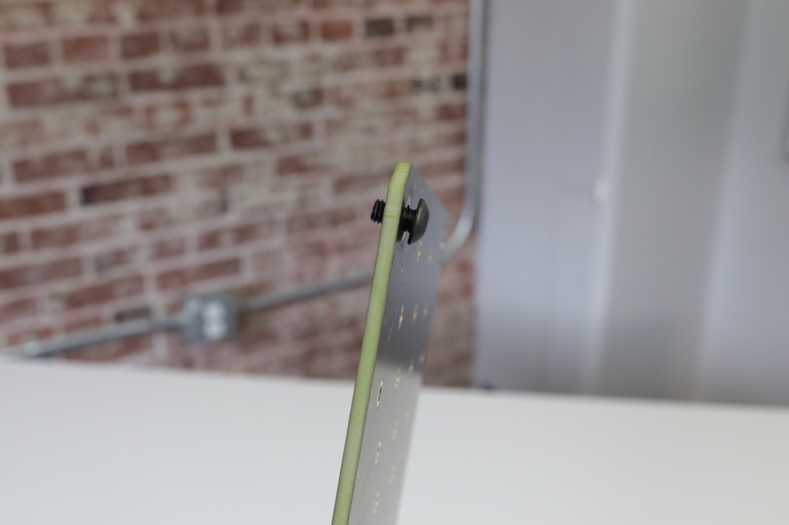

<!-- markdownlint-disable-file MD045-->
# Mounting Staging Plates

In this step, you will mount the Staging Plate and Build Plate to the machine's frame.

1. Remove the staging plate and build plate from the first tray. The staging plate has the motherboard, camera, pumps, valves, wiring, and tubing mounted on it. The build plate is bare.
  
  
  
2. Remove the rubber band from around the nozzle rack

2. Get 8x M5x8mm button head screws and 8x t-slot nuts from your hardware bag.
  

3. Insert the button head screws through the large holes in the four corners of each plate. Make sure you are inserting them from the side of the plate that has the description text as shown, and not from the side with the Opulo logo. Loosely thread a t-slot nut onto the opposite side of each screw.
  
  
  
  

4. Place the staging plate into the machine as shown below. Have it rest on the lower of the two extrusions in each leg assembly. Make sure the staging plate's orientation matches the images below.
  
  
  
  

5. Make sure that the staging plate is sitting flush on the extrusions. The t-slot nut should fit inside the slot in the extrusion.
  
  

6. Grab the alignment bracket that you used earlier.
  

7. Place the bracket along the front rail with the long side pointing away from you. Arrange the staging plate so that it is flat against the bracket.
  
  

8. While ensuring that the flat edge of the staging is flush against the side of the extrusion, tighten the screw closest to the front of the machine. Don't tighten the back one just yet.
  
  

9. Move the alignment bracket to the right side, and while ensuring the staging plate is right up against it, tighten both screws on the right side.
  
  

10. Tighten the second screw on the left side of the machine.
  

11. Use the alignment bracket again to confirm that the staging plate is still aligned correctly.
12. Place the build plate onto the same rail as the staging plate. Ensure the t-slot nuts are fully inserted into the extrusion.
  
  

12. Slide the build plate flush against the staging plate, and tighten all four screws.
  

14. Grab the build plate foot from the second tray, and unscrew the screw in the print.
  
  

13. Lift the machine up onto its back legs.

15. Mount the build plate foot in the center of the circle cutout, right beneath the goblin icon. Tighten the screw you removed earlier in from the top side to secure it in place.
  
  

## Next Steps

The plates are fully mounted! Time to move on to [wiring](../wiring-3-1/index.md).
