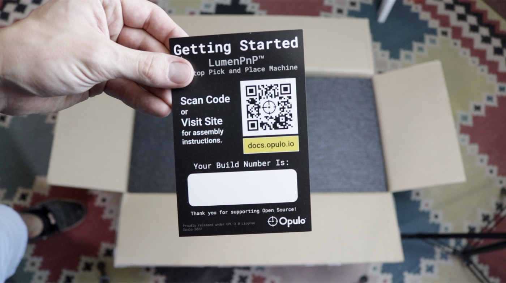

<!-- markdownlint-disable-file MD045-->
# Unboxing

1. First, take a look at what's in the box! The first thing you'll see when you open the package is the getting started card. This card has your machine's version number on it. 

	!!!warning "Make sure your version number begins with `v3.1`."

  	
  	

2. Remove the top protective layer of foam revealing the first tray of components. This tray contains:
    * Staging plate
    * Build plate
    * Feet for the build and staging plates
    * 4x Extension feet for the y-gantry left/right leg assemblies
    * Cable chain assembly
    * Cable chain frame mount
    * IEC power cable and power supply
    * Front rail w/25 feeder slots installed
    * Back rail w/25 feeder slots installed
    * Feeder Slot Cable Harness
    * 10x Extrusion cable clips

     	

3. Grab the foam as shown below, rotate the tray up, then pull it out and set it aside, revealing the second tray of parts.

    
    
    

4. The second tray contains the following parts:
    * y-gantry left/right leg assemblies
    * X gantry assembly
    * Getting started kit
    * Tool bag

    

5. Open up the tool bag. Inside, you'll find the following items:
    * Hobby knife
    * Flush snips
    * 135 degree tweezers
    * Allen wrench set w/separate 1.3mm driver for adjusting feeder drive wheels
    * Small Phillips screwdriver
    * Alignment bracket
    * Bottom camera cable
    * ESD wrist strap
    * USB-A to USB-B cable
    * Hardware bag
    * Zip ties
    * Feeder programmer
  
    
    

## Next Steps

Alright, let's move on to [assembling the frame](../assembling-frame-3-1/index.md).
