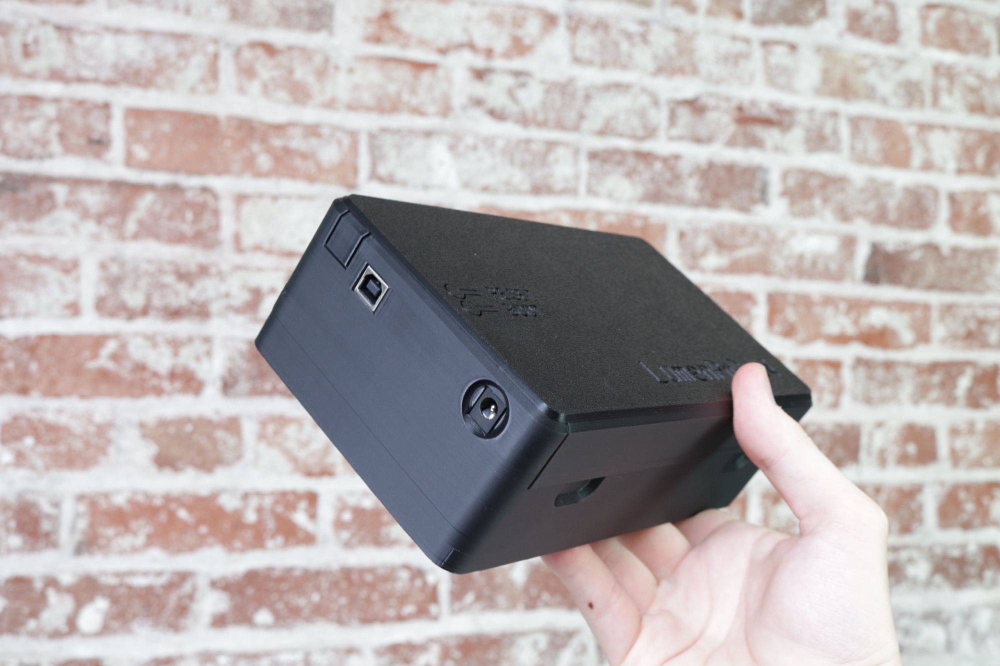
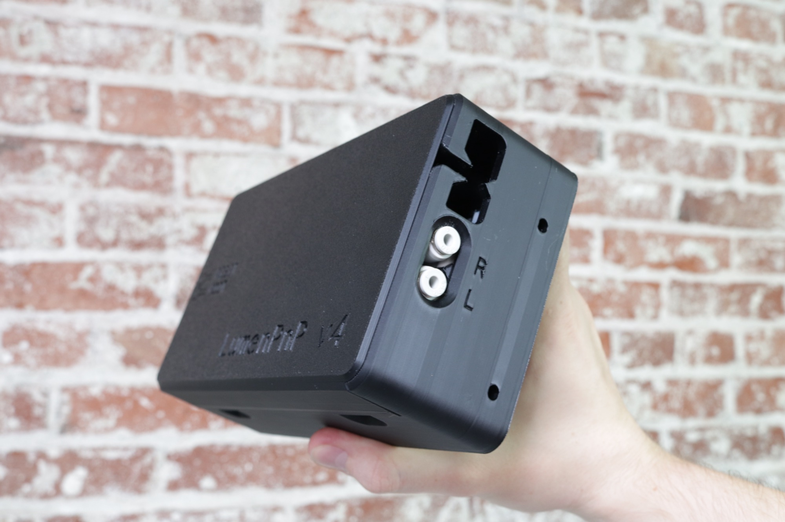

## Control Box Installation

1. Remove the control box from the packaging.

     
    
    
    

1. Remove the cover but lifting by the tab on the bottom. Set the cover aside.

    
     

1. Get 2x M5x10mm socket head bolts and `2x` T-slot nuts from your hardware kit.

     

1. Drop the M5x10mm bolts into the channels in the control box and ensure they stick out the back side of the box. Loosely thread the T-slot nuts onto both of them using an allen key.

     
     
     

1. Loosely attach onto the left Y-gantry as shown.

     
     
    

1. Get the X drag chain support from the packaging.

    

1. Use the straight side to correctly space the control box from the front left leg.

    
    

1. Tighten the control box in place at the correct spacing.

    
    

## Underside Wiring

1. Gently move the head all the way back, and lift the machine onto its back legs as shown.

      

1. Find the Y2 cable on the right side of the machine.

    

1. Using an allen key, loosen the cable clamp on the staging plate, route the cable under the clamp, and tighten it in place.

       

1. Route the Y2 cable across the staging plate and secure in place using the other cable clamp. Make sure to pull the cable taught before securing in place. It should not hang or droop.

       

1. Route the Y2 cable up and over the control box as shown, along with the Y1 cable that's pre-routed on the left Y gantry as shown below.

    

1. Get the Feeder Blade Harness Set from the packaging, and remove the longer cable with a `FRONT BLADES` and `BACK BLADES` label on either end.

     

1. Plug the `FRONT BLADES` end into the connector on the right side of the top rail.

     

1. Push the cable into four extrusion cable clips found in a bag from the packaging, and snap them into the extrusion as shown below.

    
      

1. Plug the other end into the connector on the right side of the bottom rail, and secure in place using another extrusion cable clip.

     

1. Get the other cable from the Feeder Blade Harness Set with a `FEEDERS-BLADE` and `FEEDERS-MOBO` label on either end.

    

1. Plug the `FEEDERS-BLADE` end into the connector on the left side of the top rail, and secure in place using an extrusion cable clip as shown. Route the other end over the control box.

     

1. Remove the rubber band holding the bundle of two cables together, and route over the control box.

      

1. Separate the USB cable from the rest of the cables, and route the remaining four into the cable retention feature in the control box.

      

1. Bring the machine back down onto four legs with the control box facing you.

     

1. Plug the four routed cables into their respective ports. Match the labels on the cables with the labels on the control board. Use the images below for reference.

        

1. Your control box interior should look like the image below.

    

## Drag Chains

1. Rotate the machine so you're facing the back. Pull the gantry towards you as shown below.

    

1. Get the drag chain assembly from the packaging.

    

1. Remove the rubber band from the end shown below. This side of the chain attaches to the machine's head.

     

1. Lay the drag chain assembly around the machine as shown. 

    !!! info "Check the polarity"

        Ensure the end with the attached 3D print is on the left side of the machine, and the side with a bundle of cables is laying along the right side.

    

1. Grab the print on the end of the chain on the left side. Find the two cables attached to the back side of the print. These cables will fit into the slot on the back side of the machine's head.

    
     

1. While guiding the cables into the channel, rotate the end of the drag chain in place as shown. Make sure it's sitting flush against the back side of the machine's head.

    
    
    

1. Bolt the head in place using am M5x16mm socket head bolt. Double check that this print is flush with the back side of the machine's head.

    

1. Plug in the top ring light and top camera using the two cables you just routed through the channel.

     

1. Find the Z motor and Z limit cables on the head, and tuck them into the slot as shown.

     

1. Plug the Z limit cable into the connector on the back side of the circuit board mounted to the front of the head. Plug the Z motor cable into the Z motor.

     

1. Check that your machine looks like the image below.

    

1. Pick up the X drag chain and hang it over the back leg as shown below.

     

1. Get the X gantry drag chain support panel and orient it as shown below, with the zig zag on the right, and the text facing upwards.

     

1. Lift the drag chain, slide the support panel underneath it, and rest the drag chain on top.

      

1. On the left side, align the holes in the support panel with the holes in the Y gantry. The X drag chain should be centered on the support panel.

     

1. Bolt the left side of the support panel into the Y gantry using `2x` M5x10mm socket head bolts.

     

1. On the right side, align the holes in the drag chain with the holes in the support panel, and with the holes in the other Y gantry.

     

1. Bolt the three together using `2x` M5x16mm flat head bolts.

     

1. Thread `2x` more M5x16mm flat head bolts through the holes in the Y drag chain by the X motor as shown.

     

1. Align these bolts with the holes in the drag chain support by the text "Y Drag Chain Mounts Here" and drop it into place. Loosely thread `2x` M5 nuts onto the bolts.

     

1. Use the cutout in the squaring bracket to hold the nuts in place while you tighten the bolts using an allen key.

       

1. Plug the X motor cable into the X motor, and plug the XY limit cable into the XY limit switch PCB as shown. Use a zip tie to secure the XY limit cable in place as shown, and snip off the excess using the snips in your tool kit.

       

1. Lay the Y drag chain on top of the control box as shown, align it with the holes in the box, and secure in place with `2x` M5x16mm flat head bolts.

       

1. Rotate the machine so the control box is facing you. Remove the rubber band holding the cable bundle together, separate the USB cable from the bundle, and route the rest of the cables into the control box as shown.

      

1. Plug the cables you just routed into their respective ports. Match the labels on the cables with the labels on the control board. Use the images below for reference.

          

1. Reattach the cover by fitting the top edge, then pushing on the bottom until it snaps into place.

     

1. Push the blue tubing into the `R` pneumatic port, and push the red tubing into the `L` pneumatic port.

     

1. Your control box should look like the image below.

    

1. Rotate the machine so you're facing the front, and pull the gantry all the way toward you.

    

1. Plug the R motor cable into the right nozzle motor port, secure it in place using a zip tie, and snip off the remainder. Press the blue tubing into the pneumatic coupler on top of the R motor.

       

1. Plug the L motor cable into the left nozzle motor port, secure it in place using a zip tie, and snip off the remainder. Press the red tubing into the pneumatic coupler on top of the L motor.

       

## Next Step

Next you'll [install OpenPnP](../../openpnp/install-config/install/index.md).
