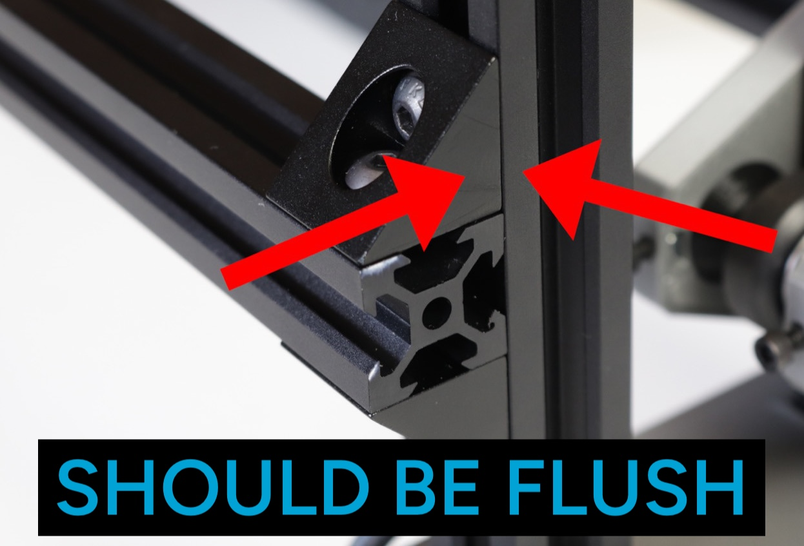
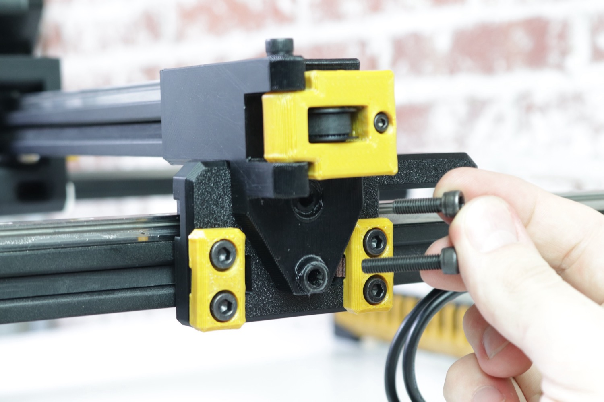
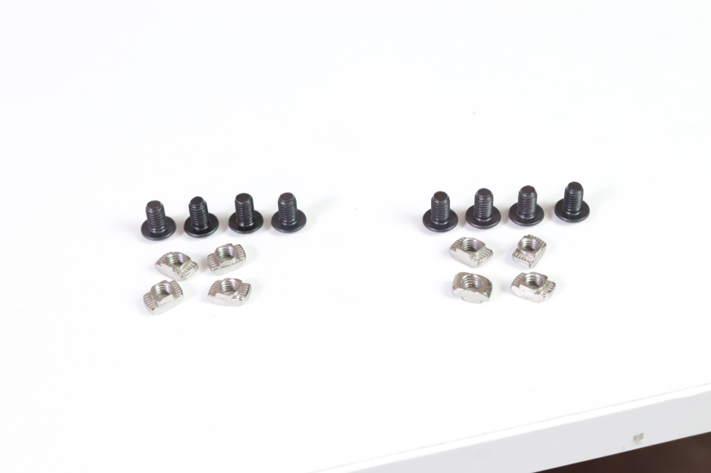
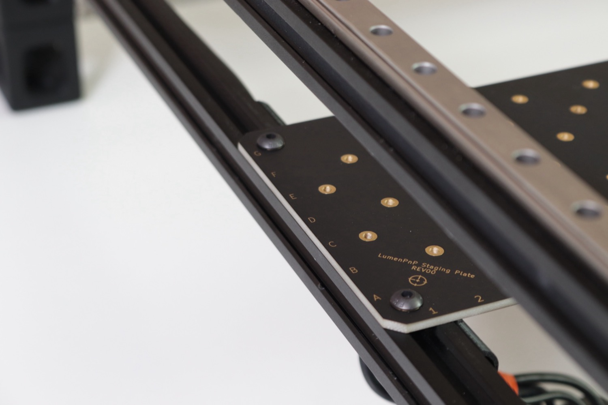

## Rails

1. Remove the left and right leg assemblies from the second tray.

    
    

2. Remove the two aluminum rails from underneath the cable chain in the first tray.

    
    
    

3. Stand the left and right leg assemblies upright on the tabletop as shown below. The left leg assembly has a cable harness labeled `Y1`, and the tensioner arm pivot is on the left. The right leg assembly has a cable harness labeled `Y2` and the tensioner arm pivot is on the right. Check the photos below for reference.

    
    

4. Tilt the left Y gantry on its side as shown.

    

5. Remove `2x` M5x10mm socket head screws and `2x` T-slot nuts from your hardware bag.

    

    !!! note "Tip"
        Use the sillouettes of the bolts on the hardware kit bag to easily identify bolts.

    

6. Insert one of the M5x10mm screws into the front left leg as shown.

    
    

7. Attach a T-slot nut onto the screw.

    
    

1.  Orient the nuts vertically as shown.

    
    

9.  Grab the front rail. It only has one right-angle bracket attached to each side, and has slots labeled 1-25.

    
    
    

10. Grab `2x` M5x8mm button head bolts and `2x` T-slot nuts from the hardware kit bag. Drop the bolts into the open holes in the right angle brackets and loosely thread the T-slot nuts onto them.

    
    
    
    

1. Align the nuts perpendicular to the rail as shown.

    
    

11. Align the front rail and left leg subassembly as shown in the image below. Make sure that the rotation of the t-slot nuts match the image.

    

12. Rotate the front rail upward as shown in the pictures below. Make sure the t-slot nut in the bracket on the front rail fits inside the bottom extrusion of the left leg subassembly. The front rail and right angle bracket should sit flush against the extrusion.

    
    

13. Slide the front rail into the front left leg. Make sure it's completely pushed into the leg with no gaps. Tighten the two screws to hold the front rail in place as shown below.

    
    
    

14. Rotate the assembly down flat on the table.

    
    

15. Attach the remaining M5x10mm socket head and t-slot nut into the front right leg in the same way as you did for the front left leg.

       

16. Orient the nut as shown.

     

17. Lift the front rail up into the bottom extrusion of the right leg subassembly, and slide it towards you into the front right leg as shown. Tighten the front screw in place.

         

18. Lift up the machine onto its back legs, and tighten in the final loose screw on the front right leg.

      

19. Get the back rail. It has two right angle brackets on each side, and slots numbered 26-50. Get `4x` M5x8mm button heads and `4x` T-slot nuts and mount them into the open holes in the right angle brackets as shown below. Do this for all four brackets.

     
     
     
     
     
     
     
     

20. Align the t-slot nuts perpendicular to the rail as shown.

    

21. Place the back rail across the back legs as shown. Rotate it upwards into the bottom extrusion of the left leg subassembly, ensuring that both t-slot nuts fit into the v-slot. It should be flush against the rail.

       

22. Make sure that the right side of the back rail has fit into the right leg extrusion. You might find that the back legs need to be pulled together or apart a little in order to get them to fit; **this is ok**. The back rail should be flush with the extrusion if the t-slot nuts have been inserted into the extrusion correctly.

    

23. Slide the back rail up and let the left side of it rest on the spacing bracket included in your tool kit. Make sure it's resting on the short side (50mm). Lightly tighten the top screw on the left side, making sure to keep the end of the extrusion and right angle brackets perfectly flush with the side of the extrusion.

    
    
    

24. Use the bracket to set the spacing on the right side, and make sure the right angle brackets are perfectly flush with the right side extrusion. Tighten both screws into place.  Go back to the left side and tighten the bottom screw.
  
    
    
    

25. Bring the machine back down onto four legs.

     

26. Slide both Y gantries to the back of the machine (opposite the tension arms).
  
     
  
27. Grab the X gantry from the packaging and fit it onto the Y gantries as shown. Make sure the toolhead motors are facing you like the image below.

      

28. Attach the X gantry to the Y gantries by installing a M5x25 socket head screw and M5x16mm socket head screw into the two holes on each side of the X gantry assembly.

         

29. Tip the machine back up onto its back legs, and install front leg extensions onto the front legs with `2x` M5x16mm socket head screws for each leg.

        
  
30. Install a back leg extension onto each of the back legs with an M5x16mm socket head screw for each leg.

       

31. Bring the machine back down onto four legs.

     

## Plates

1. Remove the staging plate and build plate from the first tray. The staging plate is packed under the control box.

    
    
    
    

2. The staging plate has the bottom camera mounted to it. The build plate is bare.
  
    
    
  
3. Get the static camera foot and the gold thumb screws from the packaging.

    
    

4. Line up the bottom camera cable with the cutout in the static camera foot as shown, and secure it in place using the two thumb screws.

    
    
    
    
    

5. Grab the build plate foot from the packaging, and remove the screw threaded into one end.

    
    

1. Drop the screw through the very center of the build plate, making sure that it's facing upwards by looking for the "LumenPnP Staging Plate" text in the corner to confirm. Attach the build plate foot with the bolt using an allen key.

    
    
    
    
    

6. Get 8x M5x8mm button head screws and 8x t-slot nuts from your hardware bag.

    

7. Insert the button head screws through the large holes in the four corners of each plate. Make sure you are inserting them from the side of the plate that has the "LumenPnP Staging Plate" text in the corner, and not from the side with the Opulo logo. Loosely thread a t-slot nut onto the opposite side of each screw.

    
    
    
    

8. The plates should look like the image below.

    

9. Pull out any wires tucked into the Y gantries, and leave them loose in the center of the machine to clear way for the plates to be mounted.

    
    

10. Place the staging plate into the machine as shown below. Have it rest on the lower of the two extrusions in each leg assembly. Make sure the staging plate's orientation matches the images below.

    
    
    

11. Make sure that the staging plate is sitting flush on the extrusions. The T-slot nut should fit inside the slot in the extrusion.

    
    

12. Get the alignment bracket that you used earlier.

    

13. Place the bracket along the front rail with the long side pointing away from you. Arrange the staging plate so that it is flat against the bracket.

    
    

14. While ensuring that the flat edge of the staging is flush against the side of the extrusion, tighten the screw closest to the front of the machine. Don't tighten the back one yet.

    
    

15. Move the alignment bracket to the right side. Tighten both screws on the right side while ensuring the staging plate is pushed up against the alignment bracket.

    
    
    

16. Tighten the second screw on the left side of the machine.

    

17. Place the build plate onto the same rail as the staging plate. Ensure the t-slot nuts are fully inserted into the extrusion.

    
    
    
    

18. Slide the build plate against the staging plate.

    

1. Make sure the build plate is flush with the extrusion, and tighten all four screws.

    
    

1. Get the Y striker from the packaging.

    

20. Slide the Y striker into the slot in the front left leg as shown, and secure in place using an M5x25mm socket head bolt.

    
    
    

You've completed the LumenPnP frame assembly. Next is installing the [electronics](../electronics/index.md).
