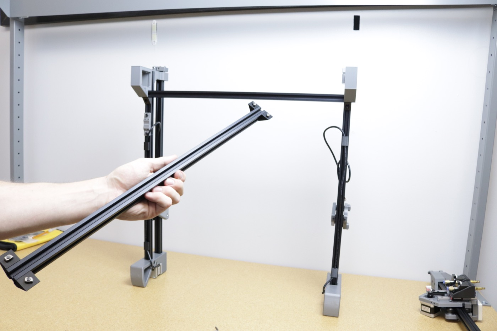
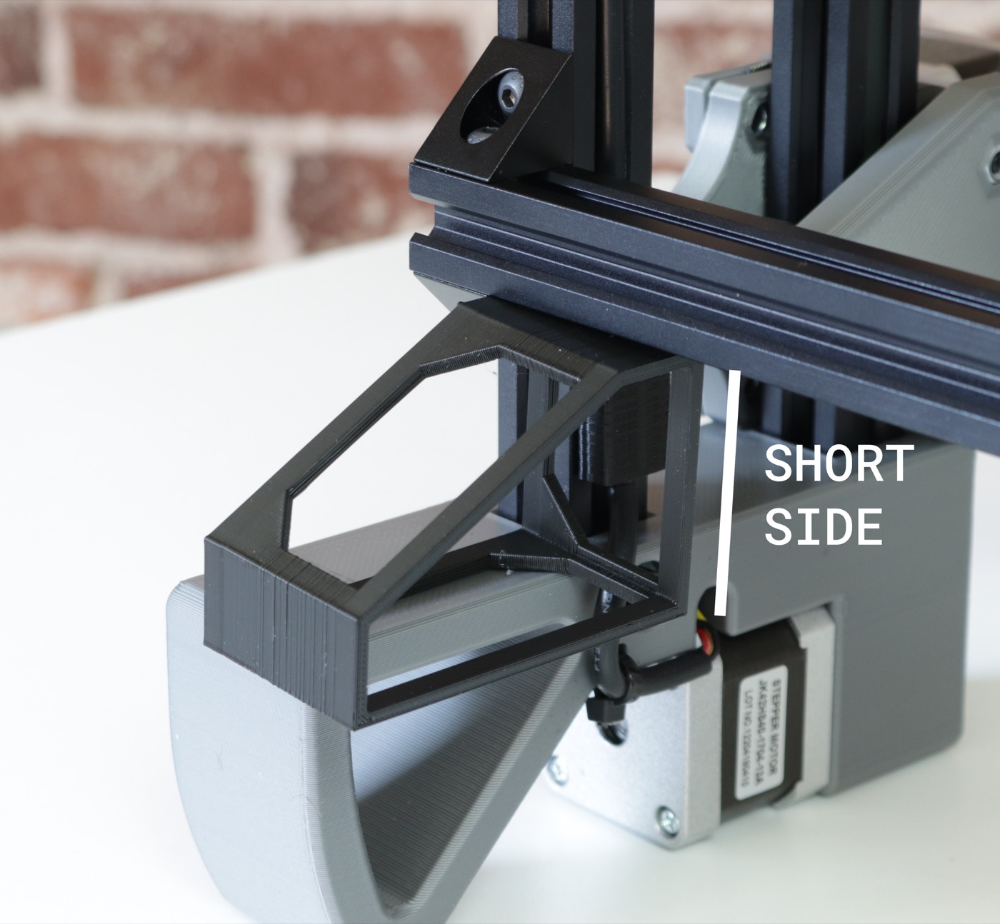

<!-- markdownlint-disable-file MD045-->
# Assembling Frame

In this step, you will assemble the main frame of the machine.

1. Remove the left and right leg assemblies from the second tray.
  
  

2. Remove the two aluminum rails from underneath the cable chain in the first tray.
  
  

3. Remove the X gantry assembly from the second tray.
  

4. Stand the left and right leg assemblies upright on the tabletop as shown below. The left leg assembly has a cable harness labeled `Y1`, and the tensioner arm pivot is on the left. The right leg assembly has a cable harness labeled `Y2` and the tensioner arm pivot is on the right. Check the photos below for reference.
  
  
  
  
  
  

5. Remove two M5x10mm socket head screws and two t-slot nuts from your hardware bag.
  

6. Insert one of the M5x10mm screws into the front left leg as shown.
  
  

7. Attach a t-slot nut onto the screw. Make sure that the nut is oriented vertically as shown in the images below.
  
  
  
  

8. Find your front rail. This is one of the two aluminum extrusions you removed from the packaging earlier. It only has one right-angle bracket attached to each side instead of two.
  
  

9. Align the front rail and left leg subassembly as shown in the image below. Make sure that the rotation of the t-slot nut in the front rail matches with the image as well. It should be perpendicular to the axis of the front rail.
  

10. Rotate the front rail upward as shown in the pictures below. Make sure the t-slot nut in the bracket on the front rail fits inside the bottom extrusion of the left leg subassembly. The front rail and right angle bracket should sit flush against the extrusion.
  
  
  

11. Slide the front rail into the front left leg. Make sure it's completely pushed into the leg with no gaps. Tighten the two screws shown below to hold the front rail in place.
  
  
  
  
  

12. Attach the remaining M5x10mm socket head and t-slot nut into the front right leg in the same way as you did for the front left leg.
  
  
  
  

13. Place the front and right leg subassemblies upright as shown in the image below.
  

14. Ensure the t-slot nut on right side of the front rail is oriented as shown below. Lift the front rail up into the bottom extrusion of the right leg subassembly, and slide it towards you into the front right leg as shown. Tighten the front screw in place.
  
  
  
  
  

15. Lift up the machine onto its back legs, and tighten in the final loose screw.
  
  
  

16. Find the back rail. This is the remaining aluminum extrusion that you removed from the first tray. It should have two right angle brackets on each side. Align the t-slot nuts perpendicular to the rail as shown in the image below. Do this for both sides.
  
  

17. Place the back rail across the back legs as shown. Rotate it upwards into the bottom extrusion of the left leg subassembly, ensuring that both t-slot nuts fit into the v-slot. It should be flush against the rail.
  
  
  

18. Make sure that the right side of the back rail has fit into the right leg extrusion. You might find that the back legs need to be pulled together or apart a little in order to get them to fit; **this is ok**. The back rail should be flush with the extrusion if the t-slot nuts have been inserted into the extrusion correctly.
  
  

19. Slide the back rail up and let the left side of it rest on the spacing bracket included in your tool kit. Make sure it's resting on the short side (50mm). Lightly tighten the top screw on the left side, making sure to keep the end of the extrusion and right angle brackets perfectly flush with the side of the extrusion. Note that you may need to loosen the screws a little to back them out of the bracket before tightening the assembly together.
  
  
  
  

20. Use the bracket to set the spacing on the right side, and tighten both screws into place. Make sure the right angle brackets are perfectly flush with the right side extrusion as well. Go back to the left side and tighten the bottom screw.
  
  
  

21. Bring your machine back down onto four legs and get the X gantry assembly (shown below).
  
  
  

22. Slide both Y gantries to the back of the machine (opposite the tension arms), and drop the X gantry assembly onto them as shown. Make sure the toolhead motors are facing you like the image below.
  
  

23. Attach the X gantry to the Y gantries by tightening four M5x25 socket head screws found in your hardware bag into the two holes on each side of the X gantry assembly.
  
  
  
  

24. Your machine frame is done!
  

## Next Steps

Time to move on to [mounting the staging plates](../mounting-staging-plates/index.md).
