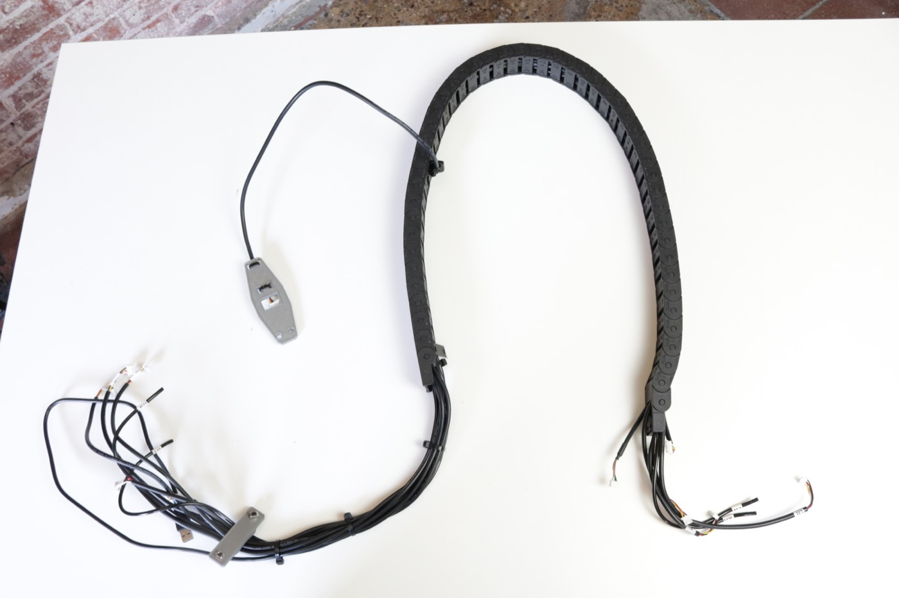
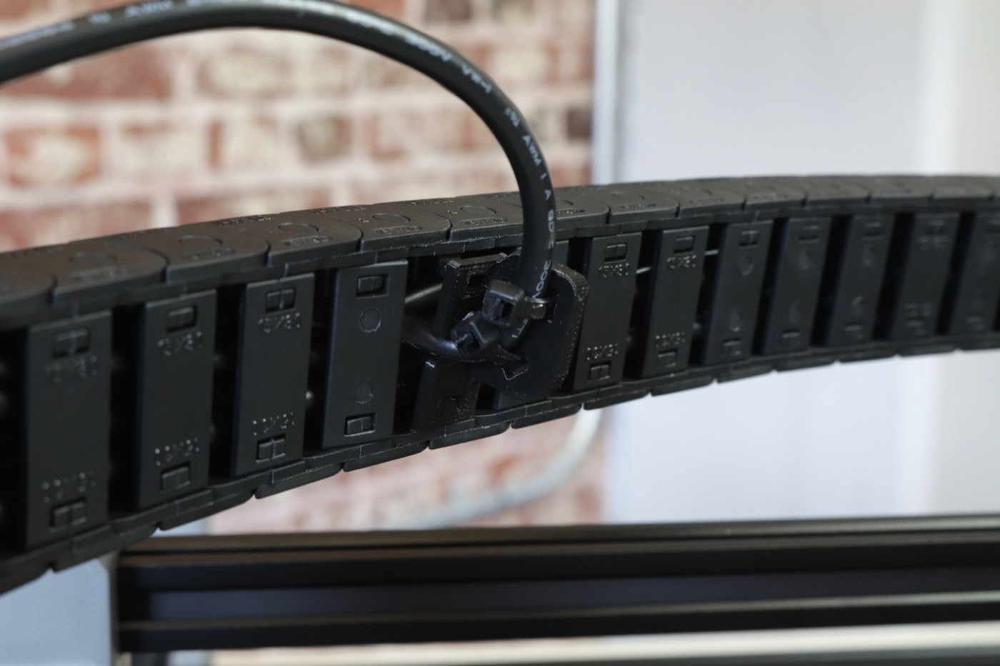
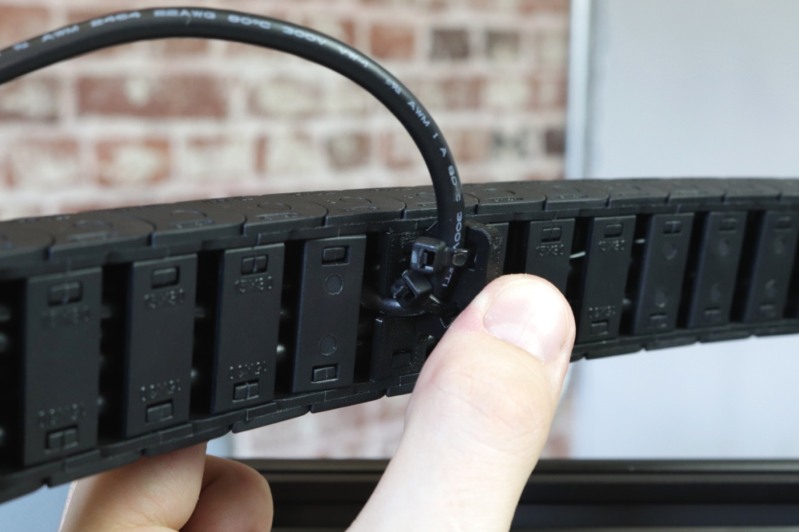
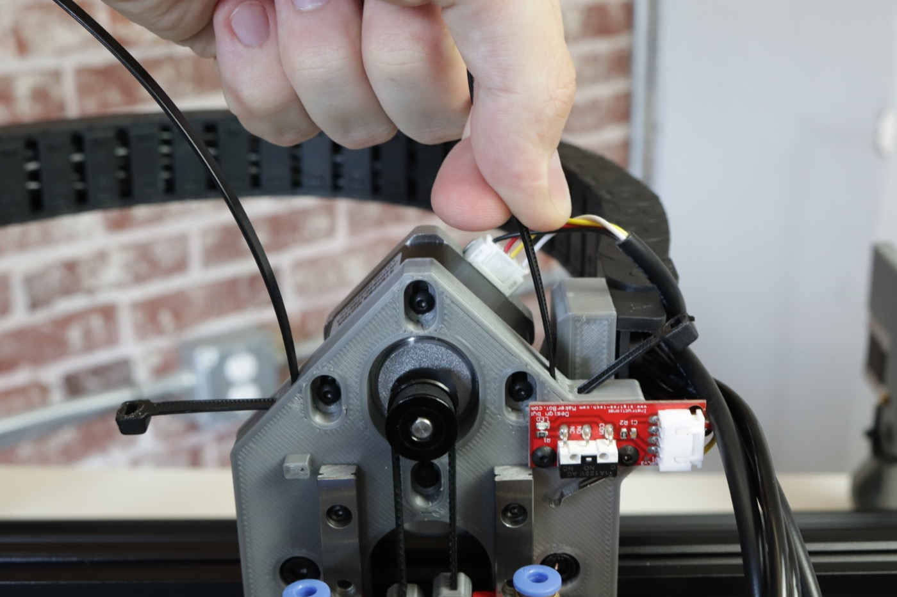
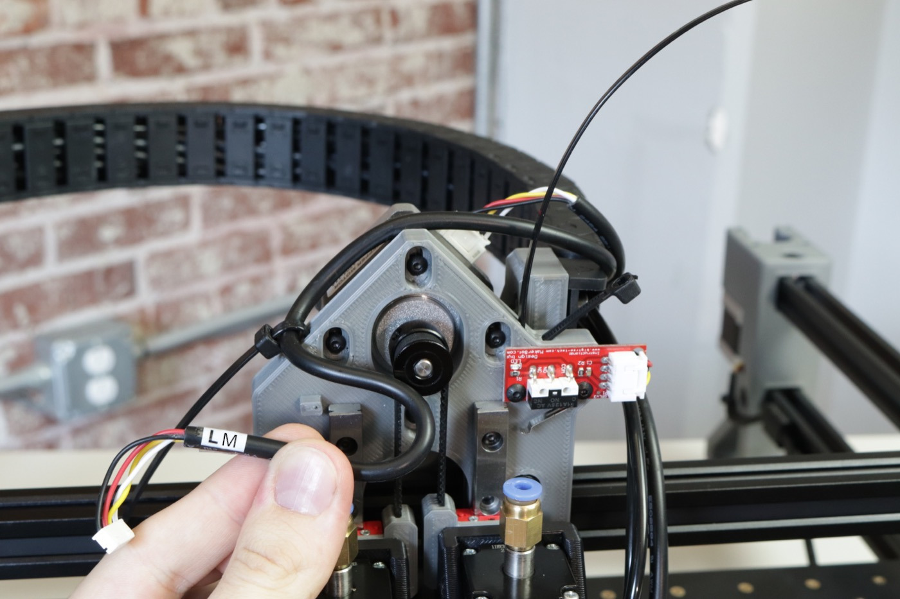
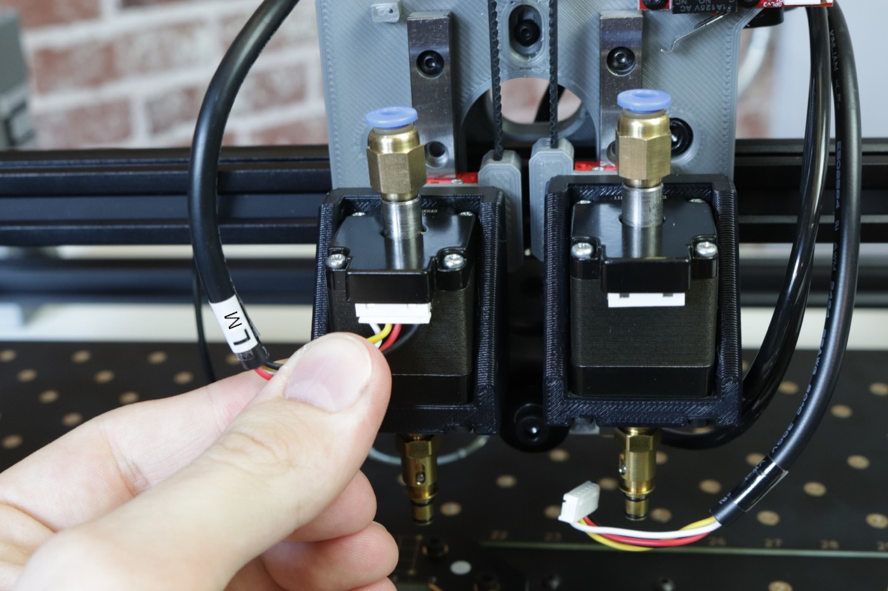
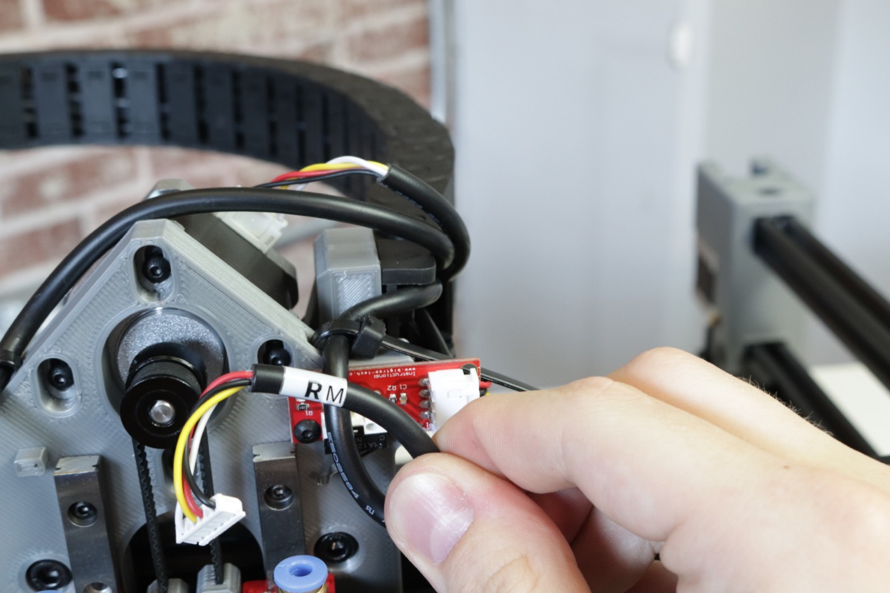
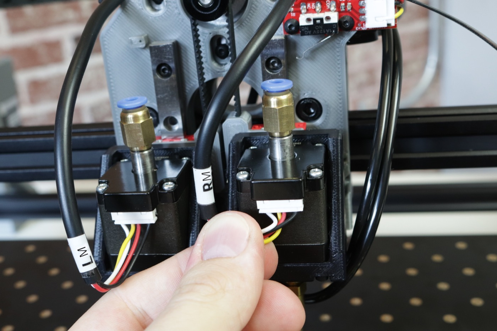
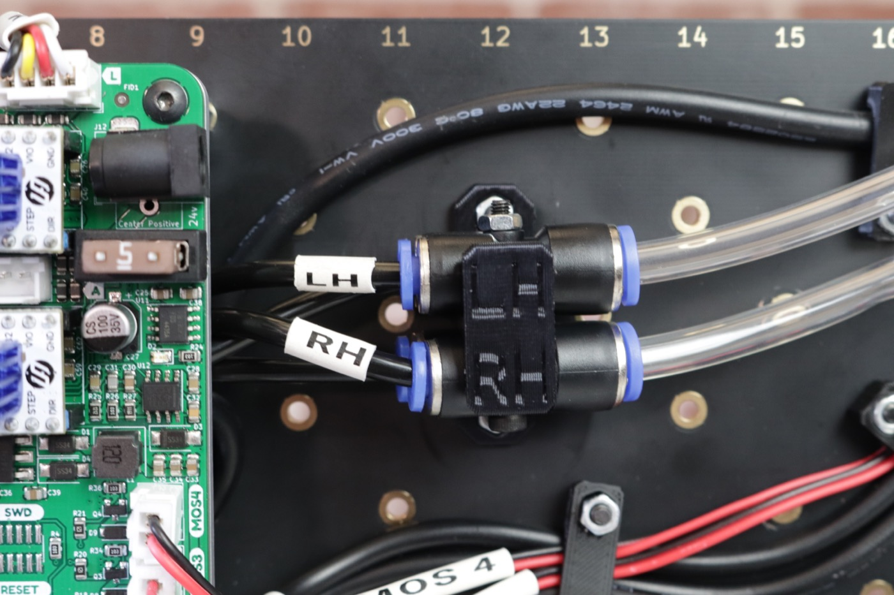

<!-- markdownlint-disable-file MD045-->
# Wiring

In this step, you will mount and connect all the wiring and pneumatic tubing.

1. Find the `front-drag-chain-mount` print in the first tray, and grab an M5x25mm and M5x16mm socket head screw from the hardware bag.
  

2. Place the `front-drag-chain-mount` on top of the front left leg as shown.
  

3. Insert the screws through the print into the front left leg, **with the M5x25mm screw on the bottom, and the M5x16mm screw on top**.
  
  
  

4. Grab the cable harness from the first tray. One side of the cable chain will have shorter wires, and the other will have longer wires with a print zip tied to it. Place your harness as shown in the image below.
  

5. Check the clip holding the cable that exits the cable chain part way through. If it has popped out during shipping, press it back into place.
  
  

6. Lift up the harness and place it onto your machine as shown below. Place the side of the cable chain with the longer wires on the ledge in the `front-drag-chain-mount`. It can help to pull your Y gantries forward to give the right side of the harness a place to rest for the next few steps.
  
  

7. Screw two M5x10mm socket head screws through the mounting holes in the cable chain and into the `front-drag-chain-mount`. If you notice that a cable chain clip pops out at any point, it can easily be pressed right back into place.
  
  
  

8. Your machine should now look like the image below.
  

9. On the other side of the cable chain, you'll notice two wires are sticking out of the back of the chain. Pull these out of the way as shown, and mount the other side of the cable chain to the X gantry using two M5x16mm socket head screws.
  
  
  

10. Look at your machine from the back. You should see the two cables you pulled aside earlier. Take the connector with four wires and plug it into the port on the back side of the camera, as shown below.
  

11. Take the remaining cable on the back side of the X gantry with only three wires and plug it into the top light, as shown below.
  

12. On the front side of the X gantry, take the connector with four holes but only three wires and plug it into the limit switch PCB.
  

13. Take the connector with six holes and four wires and plug it into the Z motor.
  

14. Grab two zip ties from the bag in your tool kit and fit them through the channels in the top side of the X gantry.
  
  

15. Find the cable labeled `LH`, route it over the top of the Z motor, and secure it in place with the zip tie on the left side of the X gantry. Trim the excess zip tie.
  
  
  

16. Plug the cable labeled `LH` into the left motor on the X gantry. This cable is inserted from the bottom.
  

17. Find the cable labeled `RH` and secure it in place using the zip tie on the right side of the X gantry. Trim the excess zip tie.
  
  

18. Plug the cable labeled `RH` into the right motor on the X gantry. This cable is inserted from the bottom.
  

19. Find the two pieces of tubing labeled `LH` and `RH`, and insert `LH` into the left motor, and `RH` into the right motor. Make sure that the tubing is in between the `LH` and `RH` cable harness going to the motors as shown in the image below.
  
  

20. Your X gantry should look like the image below.
  

21. Take the print attached to the wire exiting from the middle of the cable chain, and align it with the back of the X motor as shown in the image below.
  

22. Using two M5x16mm socket head screws, mount the X cable guide to the Y gantry. Then plug the cable into the X motor.
  
  

23. Your machine should look like the image below. Lift it up onto its back legs for final wiring steps.
  
  

24. Remove the motherboard cover by unscrewing any screws, lifting the top edge away from the board, and rotating it out from underneath the pneumatic tubing.
  
  
  

25. Take the `Y1` cable harness that came attached to the left leg assembly and guide it underneath the motherboard from the left side, and out through the top as shown. Plug the connector into the second port from the left and tuck any excess cabling underneath the motherboard.
  
  

26. Using the cable clips as shown below, guide the `Y2` cable harness from the right leg assembly across the top of the staging plate, under the motherboard, and out through the top. You'll have to loosen the clips using an allen key to get the cable underneath them. Be sure to clamp them down tight so the cable doesn't hang loosely.
  
  
  
  

27. Plug the `Y2` cable harness into the third port from the left. Tuck any excess cabling underneath the motherboard.
  

28. Take a look at the bundle of cables coming from the cable chain. One cable with a USB connector will not be zip tied into the print. Move this cable out of the way for now, as we won't be routing it with the rest of the cables.
  

29. Isolate the following items from the bundle, and guide them under the motherboard from the left side, and out through the top as shown below.
    - `RH` tubing
    - `LH` tubing
    - `XM` cable harness
    - `ZM` cable harness
    - `LM` cable harness
  
  

30. Plug the `XM` cable harness into the first port from the left (labeled "X"), plug the `ZM` cable harness into the fourth port from the left (labeled "Z"), and plug the `LM` cable harness into the port on the far left (labeled "L").
  
  
  

31. Take the two tubes left and stick them back under the motherboard, out the right side, and plug them into the pneumatic fitting that matches the label on the tubing.
  
  
  

32. With the remaining three cable harness from the bundle, plug the harness labeled `RM` into the first port in the second row (labeled "R"), plug the harness labeled `ZL` into the Z Limit Switch port, and plug the harness labeled `DL` into the Top Light port.
  
  
  

33. Tuck any excess cabling underneath the motherboard. Your machine should look like the image below.
  

34. Attach the strain relief print into the bottom of the bottom rail in the left leg assembly.
    

    !!! Note
        If you purchased any [8mm Photon Feeders](https://opulo.io/products/8mm-feeder), follow the steps for [installing the Slot Harness](../../feeders/2-install-harness/installing-the-slot-harness.md) now, and then come back here to plug in the last few wires below.

35. Fit the cover back onto the motherboard by rotating it underneath the pneumatic tubing, and pressing down around the stepper driver pins and heatsinks. Remount using the hardware it was originally mounted with.
  
  
  

36. Grab the USB <-> 4 pin connector cable from your tool bag, and plug the 4 pin connector into the back of the bottom camera. Attach the cable to the bottom camera mount using a zip tie and snip off the excess.
  
  

37. Find the staging plate foot from the second tray, and press fit it onto the bottom camera mount, taking care to align the cutout with the bottom camera cable.
  
  

38. Route the USB cable underneath the motherboard.
  
  

39. Plug the power supply into a wall outlet, and plug the barrel jack into the port in the upper-right corner of the motherboard. You should see a light come on underneath the cover.
40. Plug the USB-B cable located in your tool bag into the USB port on the bottom-left corner of the motherboard.
41. Lower your machine down onto all four legs.
42. Plug the three USB cables coming from your machine into your computer. Depending on your computer's hardware, you might need to plug these all into separate USB ports on your computer and not use an external hub. We'll cover more about this later during calibration.

You're done with your build! Time to head over to the OpenPnP section of the docs for calibration and running your first job:

## Next Steps

You're done with your build! Next, you'll set up [OpenPnP.](../../openpnp/index.md)
