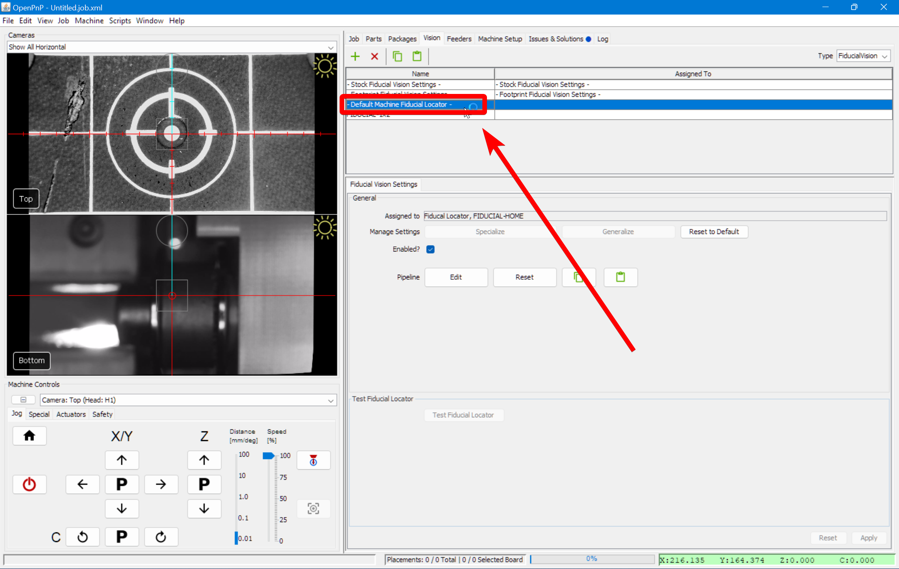

# Part Identification
<!-- ### Part Recognition

1. Go to the `Vision` tab.
  

1. Select on `BottomVision` from the type dropdown.
  

1. Select `- Default Machine Bottom Vision -` from the pipeline list.
  

1. Click on Pipeline `Edit`.
   -->
